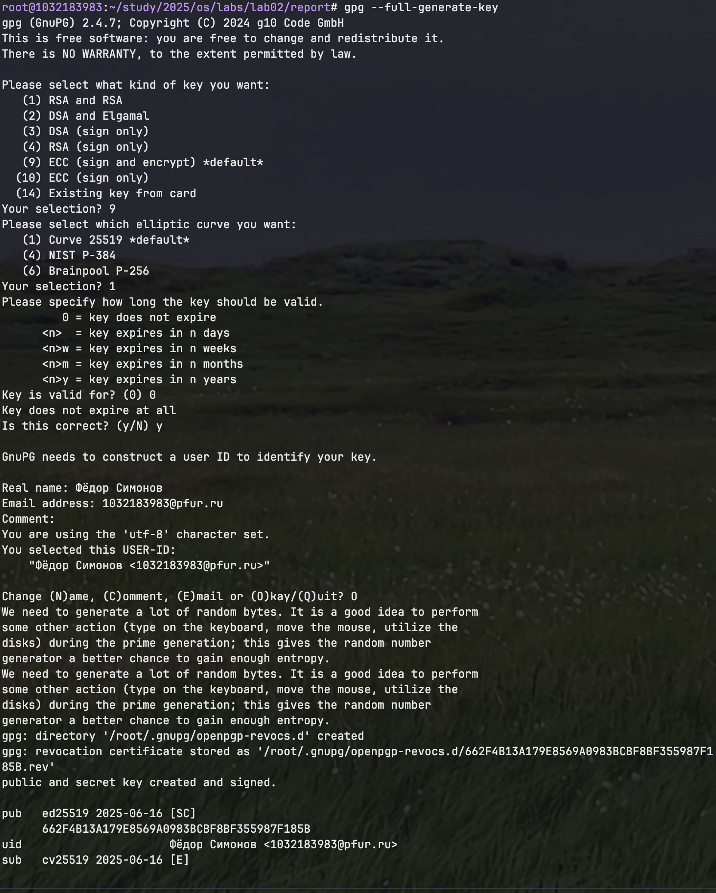
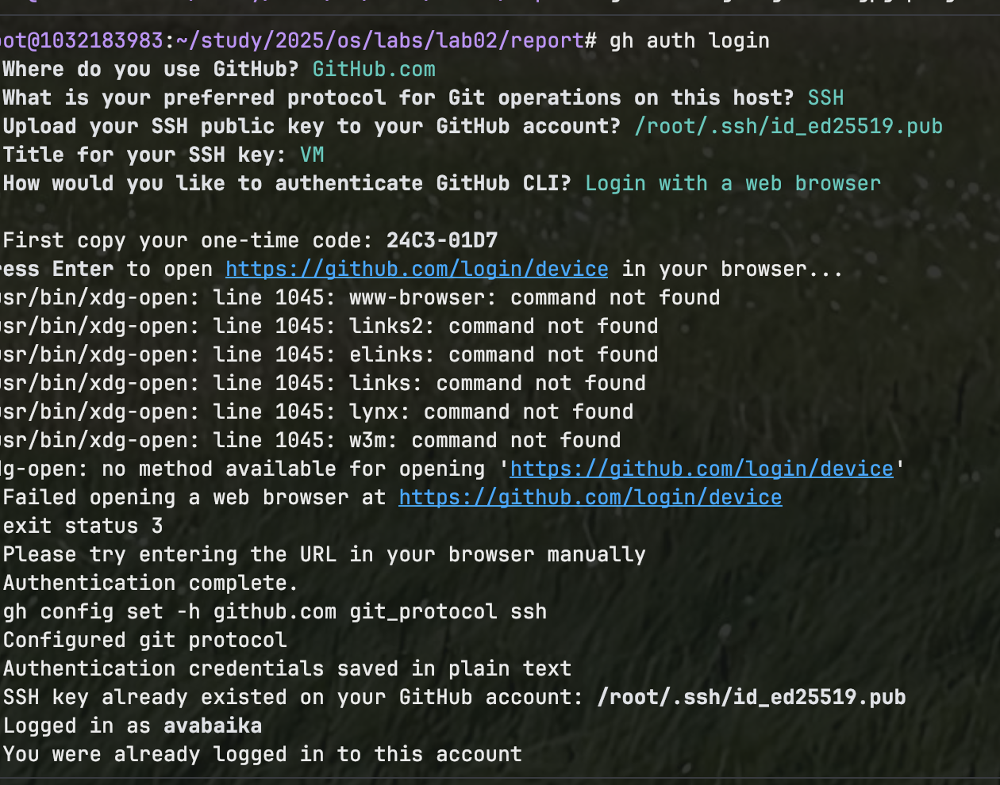
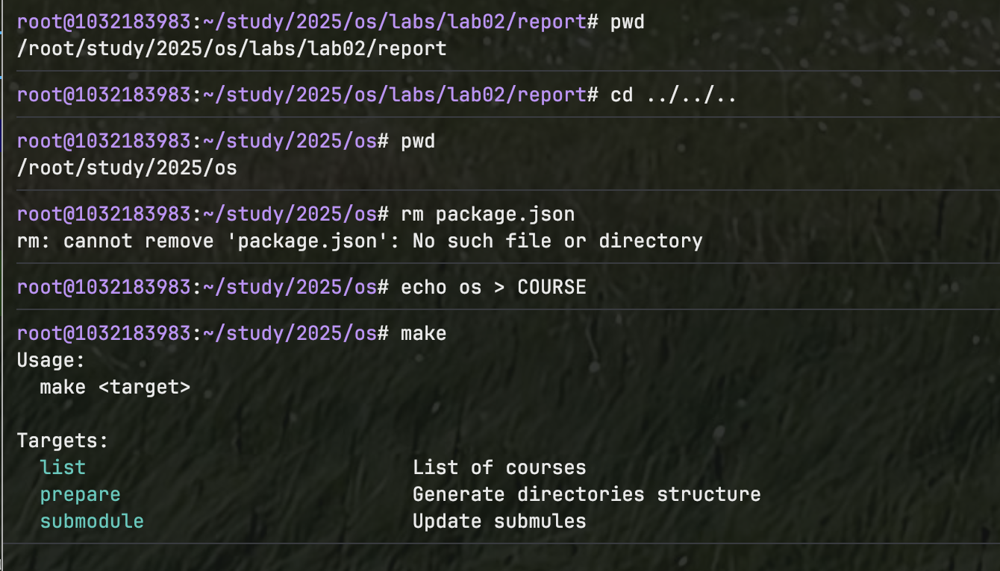

---
## Front matter
title: "Отчёт по лабораторной работе №2"
subtitle: "Первоначальная настройка git"
author: "Фёдор Симонов"

## Generic otions
lang: ru-RU
toc-title: "Содержание"

## Bibliography
bibliography: bib/cite.bib
csl: pandoc/csl/gost-r-7-0-5-2008-numeric.csl

## Pdf output format
toc: true # Table of contents
toc-depth: 2
lof: true # List of figures
lot: true # List of tables
fontsize: 12pt
linestretch: 1.5
papersize: a4
documentclass: scrreprt
## I18n polyglossia
polyglossia-otherlangs:
  name: english
## I18n babel
babel-lang: russian
babel-otherlangs: english
## Fonts
mainfont: "IBM Plex Serif"
romanfont: "IBM Plex Serif"
sansfont: "IBM Plex Sans"
monofont: "IBM Plex Mono"
mathfont: "STIX Two Math"
mainfontoptions: Ligatures=Common,Ligatures=TeX,Scale=0.94
romanfontoptions: Ligatures=Common,Ligatures=TeX,Scale=0.94
sansfontoptions: Ligatures=Common,Ligatures=TeX,Scale=MatchLowercase,Scale=0.94
monofontoptions: Scale=MatchLowercase,Scale=0.94,FakeStretch=0.9
mathfontoptions:
## Biblatex
biblatex: true
biblio-style: "gost-numeric"
biblatexoptions:
  - parentracker=true
  - backend=biber
  - hyperref=auto
  - language=auto
  - autolang=other*
  - citestyle=gost-numeric
## pandoc-xnos customization
fignos-cleveref: True
fignos-plus-name: Рис.
tablenos-cleveref: True
tablenos-plus-name: Таблица
eqnos-cleveref: True
eqnos-plus-name: Ур.
secnos-cleveref: True
secnos-plus-name: Разд.
## Misc options
indent: true
header-includes:
  - \usepackage{hyperref}
  - \usepackage{indentfirst}
  - \usepackage{float} # keep figures where there are in the text
  - \floatplacement{figure}{H} # keep figures where there are in the text
---

# Цель работы

Изучить идеологию и применение средств контроля версий. Освоить умения по работе с git.

# Задание

1. Создать базовую конфигурацию для работы с git.
2. Создать ключ SSH.
3. Создать ключ PGP.
4. Настроить подписи git.
5. Зарегистрироваться на Github.
6. Создать локальный каталог для выполнения заданий по предмету.

# Теоретическое введение

## Системы контроля версий

Системы контроля версий (Version Control System, VCS) применяются при работе нескольких человек над одним проектом. Обычно основное дерево проекта хранится в локальном или удалённом репозитории, к которому настроен доступ для участников проекта [@tanenbaum_book_modern_os:2015; @tanenbaum_book_distributed_systems:2017].

В классических системах контроля версий используется централизованная модель, предполагающая наличие единого репозитория для хранения файлов. Выполнение большинства функций по управлению версиями осуществляется специальным сервером.

В распределённых системах контроля версий центральный репозиторий не является обязательным. Среди классических VCS наиболее известны CVS, Subversion, а среди распределённых — Git, Bazaar, Mercurial.

## Основные команды git

Наиболее часто используемые команды git:

- `git init` — создание основного дерева репозитория
- `git pull` — получение обновлений текущего дерева из центрального репозитория
- `git push` — отправка всех произведённых изменений локального дерева в центральный репозиторий
- `git status` — просмотр списка изменённых файлов в текущей директории
- `git diff` — просмотр текущих изменений
- `git add .` — добавить все изменённые и/или созданные файлы и/или каталоги
- `git add имена_файлов` — добавить конкретные файлы
- `git rm имена_файлов` — удалить файл из индекса репозитория
- `git commit -am 'Описание коммита'` — сохранить все добавленные изменения
- `git checkout -b имя_ветки` — создание новой ветки
- `git checkout имя_ветки` — переключение на ветку
- `git merge --no-ff имя_ветки` — слияние ветки с текущим деревом

# Выполнение лабораторной работы

## Установка программного обеспечения

### Установка git

Для установки git в Fedora выполним команду:

```bash
dnf install git
```

{#fig:001 width=70%}

### Установка gh

Установим утилиту gh для работы с GitHub из командной строки:

```bash
dnf install gh
```

{#fig:002 width=70%}

## Базовая настройка git

Зададим имя и email владельца репозитория:

```bash
git config --global user.name "Фёдор Симонов"
git config --global user.email "fyodor.simonov@example.com"
```

Настроим utf-8 в выводе сообщений git:

```bash
git config --global core.quotepath false
```

Зададим имя начальной ветки (будем называть её main):

```bash
git config --global init.defaultBranch master
```

Настроим параметр autocrlf:

```bash
git config --global core.autocrlf input
```

Настроим параметр safecrlf:

```bash
git config --global core.safecrlf warn
```

{#fig:003 width=70%}

## Создание ключей ssh

### Создание ключа по алгоритму ed25519

Создадим ключ по алгоритму ed25519:

```bash
ssh-keygen -t ed25519
```

### Уже создал ключ по алгоритму ed25519 при создании репозитория

{#fig:005 width=70%}

## Создание ключей pgp

Генерируем ключ GPG:

```bash
gpg --full-generate-key
```

При генерации ключа выбираем:
- тип ed25519
- размер 4096
- срок действия: значение по умолчанию — 0 (не истекает никогда)

Вводим личную информацию:
- Имя: Фёдор Симонов
- Адрес электронной почты: fyodor.simonov@example.com
- Комментарий: можно оставить пустым

{#fig:006 width=70%}

## Добавление ключей в GitHub

### Добавление SSH ключа

Скопируем созданный SSH-ключ в буфер обмена:

```bash
xclip -i < ~/.ssh/id_ed25519.pub
```

Затем добавим ключ в настройках GitHub в разделе "SSH and GPG keys".

{#fig:007 width=70%}

### Добавление PGP ключа

Выведем список ключей и скопируем отпечаток приватного ключа:

```bash
gpg --list-secret-keys --keyid-format LONG
```

Экспортируем ключ в формате ASCII:

```bash
gpg --armor --export <PGP Fingerprint> | xclip -sel clip
```

Добавим ключ в настройках GitHub.

{#fig:008 width=70%}

## Настройка автоматических подписей коммитов

Настроим Git для автоматической подписи коммитов:

```bash
git config --global user.signingkey <PGP Fingerprint>
git config --global commit.gpgsign true
git config --global gpg.program $(which gpg2)
```

{#fig:009 width=70%}

## Настройка gh

Авторизуемся в gh:

```bash
gh auth login
```

При авторизации выбираем следующие опции:
- What account do you want to log into? GitHub.com
- What is your preferred protocol for Git operations? SSH
- Upload your SSH public key? Выбираем созданный ключ
- How would you like to authenticate GitHub CLI? Login with a web browser

{#fig:010 width=70%}

## Создание репозитория курса

### Создание репозитория на основе шаблона

Создадим репозиторий курса на основе шаблона:

```bash
mkdir -p ~/study/2025/os
cd ~/study/2025/os
gh repo create study_2025_os-intro --template=yamadharma/course-directory-student-template --public
git clone --recursive git@github.com:fyodorsimonov/study_2025_os-intro.git .
```

[//]: # (![Создание репозитория]&#40;image/repo-create.png&#41;{#fig:011 width=70%})

### Настройка каталога курса

Перейдём в каталог курса и выполним настройку:

```bash
cd ~/study/2025/os
rm package.json
echo os > COURSE
make
```

{#fig:012 width=70%}

Отправим файлы на сервер:

```bash
git add .
git commit -am 'Initial commit'
git push
```

{#fig:013 width=70%}

# Выводы

В ходе выполнения лабораторной работы были изучены идеология и применение средств контроля версий, а также освоены умения по работе с git. Была выполнена базовая настройка git, созданы SSH и PGP ключи, настроены автоматические подписи коммитов. Также был создан репозиторий курса на основе шаблона и выполнена его первоначальная настройка.

# Контрольные вопросы

1. **Что такое системы контроля версий (VCS) и для решения каких задач они предназначаются?**

   Системы контроля версий (VCS) — это программные инструменты для отслеживания изменений в файлах и координации работы нескольких людей над общими файлами. Они предназначены для решения следующих задач:
   - Хранение истории изменений файлов
   - Возможность отката к предыдущим версиям
   - Совместная работа нескольких разработчиков
   - Слияние изменений от разных авторов
   - Ведение нескольких версий проекта одновременно

2. **Объясните следующие понятия VCS и их отношения: хранилище, commit, история, рабочая копия.**

   - **Хранилище (репозиторий)** — база данных, содержащая все версии файлов проекта и метаинформацию
   - **Commit** — зафиксированное состояние проекта в определённый момент времени
   - **История** — последовательность всех коммитов проекта
   - **Рабочая копия** — локальная копия файлов проекта, с которой непосредственно работает пользователь

3. **Что представляют собой и чем отличаются централизованные и децентрализованные VCS? Приведите примеры VCS каждого вида.**

   - **Централизованные VCS** имеют единый центральный сервер, хранящий все версии файлов. Примеры: CVS, Subversion (SVN)
   - **Децентрализованные (распределённые) VCS** позволяют каждому пользователю иметь полную копию репозитория. Примеры: Git, Mercurial, Bazaar

4. **Опишите действия с VCS при единоличной работе с хранилищем.**

   При единоличной работе типичный цикл включает:
   - Внесение изменений в файлы
   - Просмотр статуса изменений (`git status`)
   - Добавление изменений в индекс (`git add`)
   - Создание коммита (`git commit`)
   - Отправка изменений на сервер (`git push`)

5. **Опишите порядок работы с общим хранилищем VCS.**

   При работе с общим хранилищем:
   - Получение последних изменений (`git pull`)
   - Создание отдельной ветки для своих изменений (`git checkout -b`)
   - Внесение и коммит изменений
   - Слияние с основной веткой (`git merge`)
   - Разрешение конфликтов при необходимости
   - Отправка изменений в общий репозиторий (`git push`)

6. **Каковы основные задачи, решаемые инструментальным средством git?**

   - Версионирование кода
   - Ветвление и слияние
   - Распределённая работа
   - Сохранение истории изменений
   - Откат изменений
   - Совместная работа над проектом

7. **Назовите и дайте краткую характеристику командам git.**

   - `git init` — инициализация репозитория
   - `git clone` — клонирование удалённого репозитория
   - `git add` — добавление файлов в индекс
   - `git commit` — создание коммита
   - `git status` — просмотр состояния рабочей копии
   - `git log` — просмотр истории коммитов
   - `git push` — отправка изменений на сервер
   - `git pull` — получение и слияние изменений с сервера
   - `git branch` — управление ветками
   - `git merge` — слияние веток

8. **Приведите примеры использования при работе с локальным и удалённым репозиториями.**

   Локальный репозиторий:
   ```bash
   git init
   git add README.md
   git commit -m "Initial commit"
   ```

   Удалённый репозиторий:
   ```bash
   git remote add origin git@github.com:user/repo.git
   git push -u origin master
   git pull origin master
   ```

9. **Что такое и зачем могут быть нужны ветви (branches)?**

   Ветви — это независимые линии разработки в репозитории. Они нужны для:
   - Изоляции экспериментальных изменений
   - Параллельной разработки разных функций
   - Поддержки разных версий проекта
   - Организации командной работы

10. **Как и зачем можно игнорировать некоторые файлы при commit?**

    Файлы игнорируются через файл `.gitignore`. Это нужно для:
    - Исключения временных файлов
    - Исключения файлов с конфиденциальной информацией
    - Исключения скомпилированных файлов
    - Исключения файлов, специфичных для IDE
    
    Пример `.gitignore`:
    ```
    *.log
    *.tmp
    .DS_Store
    node_modules/
    ```

# Список литературы{.unnumbered}

::: {#refs}
:::