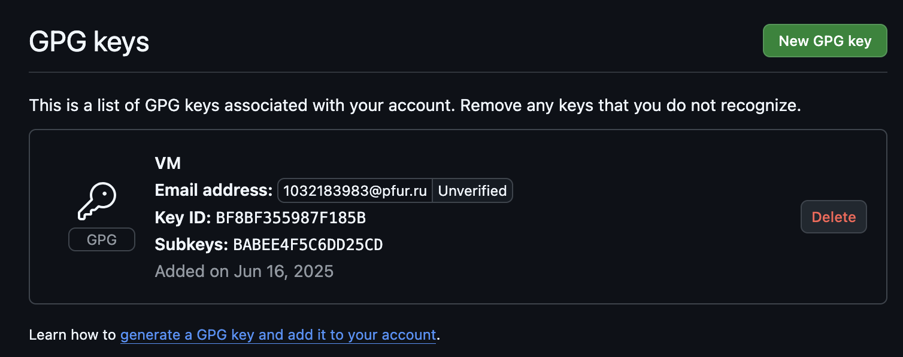

---
## Front matter
lang: ru-RU
title: Лабораторная работа №2
subtitle: Первоначальная настройка git
author:
  - Фёдор Симонов
institute:
  - Российский университет дружбы народов, Москва, Россия
date: 15 июня 2025

## i18n babel
babel-lang: russian
babel-otherlangs: english

## Formatting pdf
toc: false
toc-title: Содержание
slide_level: 2
aspectratio: 169
section-titles: true
theme: Madrid
header-includes:
  - \usepackage{polyglossia}
  - \setmainlanguage{russian}
  - \setotherlanguage{english}
  - \setmainfont{IBM Plex Serif}
  - \newfontfamily\cyrillicfontsf{IBM Plex Sans}
  - \newfontfamily\cyrillicfonttt{IBM Plex Mono}
---

# Цели и задачи работы

## Цель лабораторной работы

Изучить идеологию и применение средств контроля версий. Освоить умения по работе с git.

## Задачи

- Создать базовую конфигурацию для работы с git
- Создать ключ SSH
- Создать ключ PGP
- Настроить подписи git
- Зарегистрироваться на Github
- Создать локальный каталог для выполнения заданий по предмету

# Теоретическое введение

## О Markdown

- **Markdown** — легковесный язык разметки
- Предназначен для обозначения форматирования в простом тексте
- Легко читаем человеком и машиной
- Может быть преобразован в различные форматы

## Основные элементы

:::::::::::::: {.columns align=center}
::: {.column width="50%"}

### Текст
- `*курсив*`
- `**полужирный**`
- `# Заголовок`

:::
::: {.column width="50%"}

### Структура
- `- список`
- `[ссылка](URL)`
- `![image.png]`

:::
::::::::::::::

# Выполнение лабораторной работы

## Установка программного обеспечения

```bash
# Установка git
dnf install git

# Установка gh
dnf install gh
```

{#fig:001 width=60%}

## Базовая настройка git

```bash
git config --global user.name "Фёдор Симонов"
git config --global user.email "1032183983@pfur.ru"
git config --global core.quotepath false
git config --global init.defaultBranch master
git config --global core.autocrlf input
git config --global core.safecrlf warn
```

{#fig:002 width=60%}

## Создание SSH ключей

:::::::::::::: {.columns align=center}
::: {.column width="50%"}

### RSA ключ
```bash
ssh-keygen -t rsa -b 4096
```

:::
::: {.column width="50%"}

### Ed25519 ключ
```bash
ssh-keygen -t ed25519
```

:::
::::::::::::::

{#fig:003 width=60%}

## Создание PGP ключа

```bash
gpg --full-generate-key
```

Параметры:
- Тип: ECC
- Размер: 4096
- Срок действия: 0 (не истекает)

{#fig:004 width=60%}

## Добавление ключей в GitHub

:::::::::::::: {.columns align=center}
::: {.column width="50%"}

### SSH ключ
```bash
xclip -i < ~/.ssh/id_ed25519.pub
```

:::
::: {.column width="50%"}

### GPG ключ
```bash
gpg --armor --export <PGP Fingerprint> | xclip -sel clip
```

:::
::::::::::::::

{#fig:005 width=60%}

## Настройка подписи коммитов

```bash
git config --global user.signingkey <PGP Fingerprint>
git config --global commit.gpgsign true
git config --global gpg.program $(which gpg2)
```

{#fig:006 width=60%}

## Авторизация в gh

```bash
gh auth login
```

Опции при авторизации:
- Account: GitHub.com
- Protocol: SSH
- SSH key: выбираем созданный ключ
- Authentication: Login with a web browser

{#fig:007 width=60%}

## Создание репозитория курса

```bash
mkdir -p ~/study/2025/os
cd ~/study/2025/os
gh repo create study_2025_os-intro \
  --template=yamadharma/course-directory-student-template \
  --public
git clone --recursive \
  git@github.com:fyodorsimonov/study_2025_os-intro.git .
```

## Настройка каталога курса

```bash
cd ~/study/2025/os
rm package.json
echo os > COURSE
make
git add .
git commit -am 'feat(main): make course structure'
git push
```

{#fig:009 width=60%}

# Результаты

## Что было сделано

- Выполнена базовая настройка git
- Созданы SSH и PGP ключи
- Настроены автоматические подписи коммитов
- Создан и настроен репозиторий курса

## Полученные навыки

- Работа с системой контроля версий Git
- Настройка безопасной аутентификации
- Использование GitHub CLI (gh)
- Организация рабочего пространства

# Выводы

## Выводы

В ходе выполнения лабораторной работы:

- Изучена идеология систем контроля версий
- Освоены основные команды git
- Настроена безопасная работа с GitHub
- Подготовлено рабочее пространство для курса

## Спасибо за внимание!