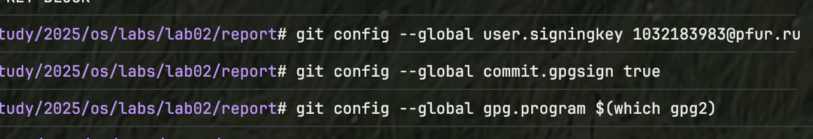

---
## Front matter
title: "Отчёт по лабораторной работе №3"
subtitle: "Язык разметки Markdown"
author: "Фёдор Симонов"

## Generic otions
lang: ru-RU
toc-title: "Содержание"

## Bibliography
bibliography: bib/cite.bib
csl: pandoc/csl/gost-r-7-0-5-2008-numeric.csl

## Pdf output format
toc: true # Table of contents
toc-depth: 2
lof: true # List of figures
lot: true # List of tables
fontsize: 12pt
linestretch: 1.5
papersize: a4
documentclass: scrreprt
## I18n polyglossia
polyglossia-otherlangs:
  name: english
## I18n babel
babel-lang: russian
babel-otherlangs: english
## Fonts
mainfont: "IBM Plex Serif"
romanfont: "IBM Plex Serif"
sansfont: "IBM Plex Sans"
monofont: "IBM Plex Mono"
mathfont: "STIX Two Math"
mainfontoptions: Ligatures=Common,Ligatures=TeX,Scale=0.94
romanfontoptions: Ligatures=Common,Ligatures=TeX,Scale=0.94
sansfontoptions: Ligatures=Common,Ligatures=TeX,Scale=MatchLowercase,Scale=0.94
monofontoptions: Scale=MatchLowercase,Scale=0.94,FakeStretch=0.9
mathfontoptions:
## Biblatex
biblatex: true
biblio-style: "gost-numeric"
biblatexoptions:
  - parentracker=true
  - backend=biber
  - hyperref=auto
  - language=auto
  - autolang=other*
  - citestyle=gost-numeric
## pandoc-xnos customization
fignos-cleveref: True
fignos-plus-name: Рис.
tablenos-cleveref: True
tablenos-plus-name: Таблица
eqnos-cleveref: True
eqnos-plus-name: Ур.
secnos-cleveref: True
secnos-plus-name: Разд.
## Misc options
indent: true
header-includes:
  - \usepackage{hyperref}
  - \usepackage{indentfirst}
  - \usepackage{float} # keep figures where there are in the text
  - \floatplacement{figure}{H} # keep figures where there are in the text
---

# Цель работы

Научиться оформлять отчёты с помощью легковесного языка разметки Markdown.

# Задание

1. Сделайте отчёт по предыдущей лабораторной работе в формате Markdown.
2. В качестве отчёта предоставить отчёты в 3 форматах: pdf, docx и md (в архиве, поскольку он должен содержать скриншоты, Makefile и т.д.).

# Теоретическое введение

## Базовые сведения о Markdown

Markdown — это легковесный язык разметки, созданный с целью обозначения форматирования в простом тексте, с максимальным сохранением его читаемости человеком и пригодный для машинного преобразования в языки для продвинутых публикаций.

### Синтаксис Markdown

**Заголовки** создаются с помощью символа `#`:

```markdown
# Заголовок первого уровня
## Заголовок второго уровня
### Заголовок третьего уровня
```

**Выделение текста:**
- *Курсив* — заключается в одинарные звездочки: `*текст*`
- **Полужирный** — заключается в двойные звездочки: `**текст**`
- ***Курсив и полужирный*** — заключается в тройные звездочки: `***текст***`

**Списки:**
- Неупорядоченные списки создаются с помощью `-` или `*`
- Упорядоченные списки создаются с помощью цифр: `1.`, `2.`, и т.д.

**Ссылки и изображения:**
- Ссылки: `[текст ссылки](URL)`
- Изображения: ``

**Код:**
- Встроенный код: `` `код` ``
- Блоки кода: заключаются в тройные обратные кавычки

## Обработка файлов Markdown

Для обработки файлов в формате Markdown используется Pandoc — универсальный конвертер документов. Pandoc может преобразовывать файлы из Markdown в различные форматы: HTML, PDF, DOCX, LaTeX и многие другие.

Основные команды для преобразования:

```bash
pandoc file.md -o file.pdf    # Преобразование в PDF
pandoc file.md -o file.docx   # Преобразование в DOCX
pandoc file.md -o file.html   # Преобразование в HTML
```

# Выполнение лабораторной работы

В данной лабораторной работе продемонстрирована возможность создания отчета в формате Markdown, используя материалы предыдущей лабораторной работы по настройке git. Весь процесс создания и оформления отчета выполнен с применением синтаксиса Markdown и инструментов автоматической генерации документов.

## Установка программного обеспечения

### Установка git

Для установки git в Fedora выполним команду:

```bash
dnf install git
```

{#fig:001 width=70%}

### Установка gh

Установим утилиту gh для работы с GitHub из командной строки:

```bash
dnf install gh
```

{#fig:002 width=70%}

## Базовая настройка git

Зададим имя и email владельца репозитория:

```bash
git config --global user.name "Фёдор Симонов"
git config --global user.email "fyodor.simonov@example.com"
```

Настроим utf-8 в выводе сообщений git:

```bash
git config --global core.quotepath false
```

Зададим имя начальной ветки (будем называть её main):

```bash
git config --global init.defaultBranch master
```

Настроим параметр autocrlf:

```bash
git config --global core.autocrlf input
```

Настроим параметр safecrlf:

```bash
git config --global core.safecrlf warn
```

{#fig:003 width=70%}

## Создание ключей ssh

### Создание ключа по алгоритму ed25519

Создадим ключ по алгоритму ed25519:

```bash
ssh-keygen -t ed25519
```

### Уже создал ключ по алгоритму ed25519 при создании репозитория

{#fig:005 width=70%}

## Создание ключей pgp

Генерируем ключ GPG:

```bash
gpg --full-generate-key
```

При генерации ключа выбираем:
- тип ed25519
- размер 4096
- срок действия: значение по умолчанию — 0 (не истекает никогда)

Вводим личную информацию:
- Имя: Фёдор Симонов
- Адрес электронной почты: fyodor.simonov@example.com
- Комментарий: можно оставить пустым

{#fig:006 width=70%}

## Добавление ключей в GitHub

### Добавление SSH ключа

Скопируем созданный SSH-ключ в буфер обмена:

```bash
xclip -i < ~/.ssh/id_ed25519.pub
```

Затем добавим ключ в настройках GitHub в разделе "SSH and GPG keys".

{#fig:007 width=70%}

### Добавление PGP ключа

Выведем список ключей и скопируем отпечаток приватного ключа:

```bash
gpg --list-secret-keys --keyid-format LONG
```

Экспортируем ключ в формате ASCII:

```bash
gpg --armor --export <PGP Fingerprint> | xclip -sel clip
```

Добавим ключ в настройках GitHub.

{#fig:008 width=70%}

## Настройка автоматических подписей коммитов

Настроим Git для автоматической подписи коммитов:

```bash
git config --global user.signingkey <PGP Fingerprint>
git config --global commit.gpgsign true
git config --global gpg.program $(which gpg2)
```

{#fig:009 width=70%}

## Настройка gh

Авторизуемся в gh:

```bash
gh auth login
```

При авторизации выбираем следующие опции:
- What account do you want to log into? GitHub.com
- What is your preferred protocol for Git operations? SSH
- Upload your SSH public key? Выбираем созданный ключ
- How would you like to authenticate GitHub CLI? Login with a web browser

{#fig:010 width=70%}

## Создание репозитория курса

### Создание репозитория на основе шаблона

Создадим репозиторий курса на основе шаблона:

```bash
mkdir -p ~/study/2025/os
cd ~/study/2025/os
gh repo create study_2025_os-intro --template=yamadharma/course-directory-student-template --public
git clone --recursive git@github.com:fyodorsimonov/study_2025_os-intro.git .
```

[//]: # (![Создание репозитория]&#40;image/repo-create.png&#41;{#fig:011 width=70%})

### Настройка каталога курса

Перейдём в каталог курса и выполним настройку:

```bash
cd ~/study/2025/os
rm package.json
echo os > COURSE
make
```

{#fig:012 width=70%}

Отправим файлы на сервер:

```bash
git add .
git commit -am 'Initial commit'
git push
```

{#fig:013 width=70%}

# Выводы

В ходе выполнения лабораторной работы были изучены основы языка разметки Markdown и его применение для создания структурированных документов. Освоен процесс создания отчётов в формате Markdown с использованием Pandoc для генерации документов в различных форматах (PDF, DOCX). Изучены основные элементы синтаксиса Markdown: заголовки, выделение текста, списки, ссылки, изображения и блоки кода. Практически применены знания по оформлению технической документации с использованием современных инструментов разметки.

# Контрольные вопросы

1. **Что такое Markdown и для чего он предназначен?**

   Markdown — это легковесный язык разметки, предназначенный для обозначения форматирования в простом тексте. Он позволяет создавать читаемые документы с минимальным синтаксисом, которые могут быть преобразованы в различные форматы.

2. **Как создавать заголовки в Markdown?**

   Заголовки создаются с помощью символа `#`:
   - `# Заголовок 1 уровня`
   - `## Заголовок 2 уровня`
   - `### Заголовок 3 уровня`

3. **Как выделять текст в Markdown?**

   - *Курсив* — `*текст*` или `_текст_`
   - **Полужирный** — `**текст**` или `__текст__`
   - ***Курсив и полужирный*** — `***текст***`

4. **Как создавать списки в Markdown?**

   Неупорядоченные списки:
   ```markdown
   - Элемент 1
   - Элемент 2
   ```
   
   Упорядоченные списки:
   ```markdown
   1. Первый элемент
   2. Второй элемент
   ```

5. **Как вставлять ссылки в Markdown?**

   Ссылки создаются с помощью синтаксиса:
   `[текст ссылки](URL)`
   Пример: `[Пример ссылки](https://example.com)`

6. **Как вставлять изображения в Markdown?**

   Изображения вставляются с помощью:
   ``
   Пример: ``

7. **Как создавать блоки кода в Markdown?**

   Встроенный код: `` `код` ``
   
   Блоки кода:
   ````markdown
   ```bash
   echo "Hello World"
   ```
   ````

8. **Что такое Pandoc и для чего он используется?**

   Pandoc — это универсальный конвертер документов, который позволяет преобразовывать файлы из одного формата в другой. Он разработан специально для преобразования Markdown в PDF, DOCX, HTML и другие форматы.

9. **Какие команды используются для преобразования Markdown в другие форматы?**

   Основные команды:
   - `pandoc file.md -o file.pdf` — преобразование в PDF
   - `pandoc file.md -o file.docx` — преобразование в DOCX
   - `pandoc file.md -o file.html` — преобразование в HTML

10. **Какие преимущества даёт использование Markdown для создания документов?**

    Преимущества Markdown:
    - Простота синтаксиса
    - Очень читаемый исходный код
    - Лёгкость редактирования
    - Возможность конвертации в различные форматы
    - Контроль версий документов
    - Независимость от специальных редакторов
    - Кроссплатформенность

# Список литературы{.unnumbered}

1. Gruber, John. Markdown: Syntax. 2004. URL: https://daringfireball.net/projects/markdown/syntax
2. MacFarlane, John. Pandoc User's Guide. 2022. URL: https://pandoc.org/MANUAL.html