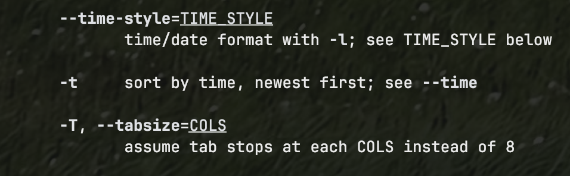

---
## Front matter
lang: ru-RU
title: Лабораторная работа №4
subtitle: Основы интерфейса взаимодействия пользователя с системой Unix на уровне командной строки
author:
  - Фёдор Симонов
institute:
  - Российский университет дружбы народов, Москва, Россия
date: 15 июня 2025

## i18n babel
babel-lang: russian
babel-otherlangs: english

## Formatting pdf
toc: false
toc-title: Содержание
slide_level: 2
aspectratio: 169
section-titles: true
theme: Madrid
header-includes:
  - \usepackage{polyglossia}
  - \setmainlanguage{russian}
  - \setotherlanguage{english}
  - \setmainfont{IBM Plex Serif}
  - \newfontfamily\cyrillicfontsf{IBM Plex Sans}
  - \newfontfamily\cyrillicfonttt{IBM Plex Mono}
---

# Цели и задачи работы

## Цель лабораторной работы

Приобретение практических навыков взаимодействия пользователя с системой посредством командной строки.

## Задачи

- Освоить основные команды Unix/Linux
- Изучить работу с файловой системой
- Научиться использовать справочную систему
- Освоить навигацию по каталогам
- Изучить управление файлами и каталогами

# Теоретическое введение

## Командная строка

- **Командная строка** — текстовый интерфейс для взаимодействия с ОС
- Взаимодействие осуществляется путём ввода команд
- Используются командные интерпретаторы: `/bin/sh`, `/bin/csh`, `/bin/ksh`

## Формат команды

```
<имя_команды><разделитель><аргументы>
```

:::::::::::::: {.columns align=center}
::: {.column width="50%"}

### Основные команды
- `man` — справочная система
- `cd` — навигация по каталогам
- `pwd` — текущий каталог
- `ls` — просмотр содержимого

:::
::: {.column width="50%"}

### Управление файлами
- `mkdir` — создание каталогов
- `rm` — удаление файлов
- `history` — история команд

:::
::::::::::::::

# Выполнение лабораторной работы

## Определение домашнего каталога

Переходим в домашний каталог (`cd ~`) и определяем его путь (`pwd`):

```bash
cd ~
pwd
```

{#fig:001 width=70%}

## Работа с каталогом /tmp

:::::::::::::: {.columns align=center}
::: {.column width="50%"}

### Переход в каталог
```bash
cd /tmp
```

:::
::: {.column width="50%"}

### Просмотр содержимого
```bash
ls
ls -a
ls -l
ls -F
```

:::
::::::::::::::

{#fig:002 width=60%}

## Различные опции команды ls

:::::::::::::: {.columns align=center}
::: {.column width="50%"}

{#fig:003 width=90%}

:::
::: {.column width="50%"}

{#fig:004 width=90%}

:::
::::::::::::::

## Проверка каталогов

Проверяем каталог `/var/spool` и просматриваем домашний каталог:

```bash
ls /var/spool
cd ~
ls -al
```

{#fig:005 width=70%}

## Операции с каталогами

Создание каталогов `newdir`, `morefun` и нескольких каталогов одновременно:

```bash
cd ~
mkdir newdir
mkdir ~/newdir/morefun
mkdir letters memos misk
```

{#fig:007 width=60%}

## Удаление каталогов

Удаление каталогов и проверка работы команды `rm`:

```bash
rm -r letters memos misk
rm newdir
rm -r newdir
```

{#fig:008 width=70%}

## Изучение команд через man

Используем справочную систему для поиска опций:

```bash
man ls
```

:::::::::::::: {.columns align=center}
::: {.column width="50%"}

### Опция -R
Рекурсивный просмотр подкаталогов

{#fig:009 width=90%}

:::
::: {.column width="50%"}

### Опция -t
Сортировка по времени

{#fig:010 width=90%}

:::
::::::::::::::

## Справка по командам

Просматриваем справку по основным командам:

```bash
man cd
man pwd
man mkdir
man rmdir
man rm
```

:::::::::::::: {.columns align=center}
::: {.column width="30%"}

{#fig:011 width=100%}

:::
::: {.column width="30%"}

{#fig:012 width=100%}

:::
::: {.column width="30%"}

{#fig:013 width=100%}

:::
::::::::::::::

## История команд

```bash
history
!5
!3:s/a/F
```

{#fig:014 width=70%}

# Результаты

## Что было изучено

- Основные команды навигации: `cd`, `pwd`
- Команды просмотра файлов: `ls` с различными опциями
- Команды управления каталогами: `mkdir`, `rm`
- Справочная система: `man`
- Работа с историей команд: `history`

## Полученные навыки

- Навигация по файловой системе Unix/Linux
- Управление файлами и каталогами
- Использование справочной системы
- Работа с командной строкой
- Понимание структуры команд и их опций

# Выводы

## Выводы

В ходе выполнения лабораторной работы:

- Приобретены практические навыки работы с командной строкой
- Изучены основные команды Unix/Linux для работы с файловой системой
- Освоена справочная система `man`
- Получены навыки навигации и управления файлами
- Изучены методы работы с историей команд

## Спасибо за внимание!