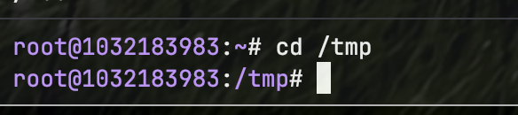
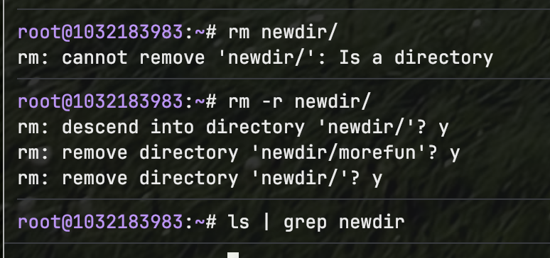

---
## Front matter
title: "Отчёт по лабораторной работе №4"
subtitle: "Основы интерфейса взаимодействия пользователя с системой Unix на уровне командной строки"
author: "Фёдор Симонов"

## Generic otions
lang: ru-RU
toc-title: "Содержание"

## Bibliography
bibliography: bib/cite.bib
csl: pandoc/csl/gost-r-7-0-5-2008-numeric.csl

## Pdf output format
toc: true # Table of contents
toc-depth: 2
lof: true # List of figures
lot: true # List of tables
fontsize: 12pt
linestretch: 1.5
papersize: a4
documentclass: scrreprt
## I18n polyglossia
polyglossia-otherlangs:
  name: english
## I18n babel
babel-lang: russian
babel-otherlangs: english
## Fonts
mainfont: "IBM Plex Serif"
romanfont: "IBM Plex Serif"
sansfont: "IBM Plex Sans"
monofont: "IBM Plex Mono"
mathfont: "STIX Two Math"
mainfontoptions: Ligatures=Common,Ligatures=TeX,Scale=0.94
romanfontoptions: Ligatures=Common,Ligatures=TeX,Scale=0.94
sansfontoptions: Ligatures=Common,Ligatures=TeX,Scale=MatchLowercase,Scale=0.94
monofontoptions: Scale=MatchLowercase,Scale=0.94,FakeStretch=0.9
mathfontoptions:
## Biblatex
biblatex: true
biblio-style: "gost-numeric"
biblatexoptions:
  - parentracker=true
  - backend=biber
  - hyperref=auto
  - language=auto
  - autolang=other*
  - citestyle=gost-numeric
## pandoc-xnos customization
fignos-cleveref: True
fignos-plus-name: Рис.
tablenos-cleveref: True
tablenos-plus-name: Таблица
eqnos-cleveref: True
eqnos-plus-name: Ур.
secnos-cleveref: True
secnos-plus-name: Разд.
## Misc options
indent: true
header-includes:
  - \usepackage{hyperref}
  - \usepackage{indentfirst}
  - \usepackage{float} # keep figures where there are in the text
  - \floatplacement{figure}{H} # keep figures where there are in the text
---

# Цель работы

Приобретение практических навыков взаимодействия пользователя с системой посредством командной строки.

# Теоретические сведения

В операционной системе типа Linux взаимодействие пользователя с системой обычно осуществляется с помощью командной строки посредством построчного ввода команд. При этом обычно используются командные интерпретаторы языка shell: `/bin/sh`, `/bin/csh`, `/bin/ksh`.

## Формат команды

Командой в операционной системе называется записанный по специальным правилам текст (возможно с аргументами), представляющий собой указание на выполнение какой-либо функций (или действий) в операционной системе. Обычно первым словом идёт имя команды, остальной текст — аргументы или опции, конкретизирующие действие.

Общий формат команд можно представить следующим образом:

```
<имя_команды><разделитель><аргументы>
```

## Основные команды Unix

### Команда man

Команда `man` используется для просмотра справочного руководства (manual) по основным командам операционной системы типа Linux в диалоговом режиме.

Формат команды: `man <команда>`

Для управления просмотром можно использовать:
- `Space` — перемещение на одну страницу вперёд
- `Enter` — перемещение на одну строку вперёд  
- `q` — выход из режима просмотра

### Команда cd

Команда `cd` используется для перемещения по файловой системе операционной системы типа Linux.

Формат команды: `cd [путь_к_каталогу]`

Для перехода в домашний каталог используется `cd` без параметров или `cd ~`.

### Команда pwd

Команда `pwd` (print working directory) используется для определения абсолютного пути к текущему каталогу.

### Команда ls

Команда `ls` используется для просмотра содержимого каталога.

Формат команды: `ls [-опции] [путь]`

Основные опции:
- `-a` — показать скрытые файлы (начинающиеся с точки)
- `-l` — подробная информация о файлах
- `-F` — отображение типа файлов с помощью символов
- `-R` — рекурсивный просмотр подкаталогов
- `-t` — сортировка по времени изменения

### Команда mkdir

Команда `mkdir` используется для создания каталогов.

Формат команды: `mkdir имя_каталога1 [имя_каталога2...]`

Опции:
- `-p` — создание каталога вместе с родительскими каталогами
- `-m` — установка прав доступа

### Команда rm

Команда `rm` используется для удаления файлов и каталогов.

Формат команды: `rm [-опции] [файл]`

Опции:
- `-r` — рекурсивное удаление каталогов
- `-i` — запрос подтверждения на удаление

### Команда history

Команда `history` выводит список ранее выполненных команд. К любой команде можно обратиться по номеру с помощью `!<номер_команды>`.

## Сокращения имён файлов

- `~` — домашний каталог
- `.` — текущий каталог  
- `..` — родительский каталог

# Выполнение лабораторной работы

## Задание 1. Определение домашнего каталога

Сначала перейдём в домашний каталог командой `cd ~`, затем определим его полное имя с помощью команды `pwd`:

```bash
cd ~
pwd
```

{#fig:001 width=70%}

## Задание 2. Работа с каталогом /tmp

### 2.1. Переход в каталог /tmp

Перейдём в каталог `/tmp` с помощью команды `cd /tmp`:

```bash
cd /tmp
```

{#fig:002 width=70%}

### 2.2. Просмотр содержимого каталога /tmp

Выведем на экран содержимое каталога `/tmp` с различными опциями команды `ls`:

Базовая команда `ls`:

```bash
ls
```

{#fig:003 width=70%}

Команда `ls -a` для просмотра скрытых файлов:

```bash
ls -a
```

{#fig:004 width=70%}

Команда `ls -l` для подробного просмотра:

```bash
ls -l
```

{#fig:005 width=70%}

Команда `ls -F` для отображения типов файлов:

```bash
ls -F
```

{#fig:006 width=70%}

### 2.3. Проверка наличия подкаталога cron

Определим, есть ли в каталоге `/var/spool` подкаталог с именем `cron`:

```bash
ls /var/spool
```

{#fig:007 width=70%}

### 2.4. Просмотр домашнего каталога

Перейдём в домашний каталог и выведем его содержимое с определением владельцев файлов:

```bash
cd ~
ls -al
```

{#fig:008 width=70%}

## Задание 3. Операции с каталогами

### 3.1-3.2. Создание каталогов

В домашнем каталоге создадим новый каталог `newdir`, а в нём — каталог `morefun`:

```bash
cd ~
mkdir newdir
mkdir ~/newdir/morefun
```

{#fig:009 width=70%}

### 3.3. Создание и удаление нескольких каталогов

Создадим одной командой три каталога `letters`, `memos`, `misk`, затем удалим их:

```bash
mkdir letters memos misk
rm -r letters memos misk
```

{#fig:010 width=70%}

### 3.4-3.5. Удаление каталога newdir

Попробуем удалить каталог `newdir` и проверим результат:

```bash
rm newdir
rm -r newdir
```

{#fig:011 width=70%}

## Задание 4. Изучение опций команды ls

С помощью команды `man ls` определим опцию для рекурсивного просмотра:

```bash
man ls
```

{#fig:012 width=70%}

## Задание 5. Сортировка по времени

Определим опции для сортировки по времени последнего изменения (продолжаем просмотр `man ls`):

{#fig:013 width=70%}

## Задание 6. Изучение команд через man

Используем команду `man` для просмотра описания следующих команд:

```bash
man cd
man pwd
man mkdir
man rmdir
man rm
```

### Команда cd

{#fig:014 width=70%}

### Команда pwd

{#fig:015 width=70%}

### Команда mkdir

{#fig:016 width=70%}

### Команда rmdir

{#fig:017 width=70%}

### Команда rm

{#fig:018 width=70%}

## Задание 7. Использование команды history

Выведем историю команд и выполним модификацию команд из буфера:

```bash
history
!5
!3:s/a/F
```

{#fig:019 width=70%}

Пример модификации команды из истории:

{#fig:020 width=70%}

# Выводы

В ходе выполнения лабораторной работы были приобретены практические навыки взаимодействия пользователя с системой посредством командной строки. Изучены основные команды Unix/Linux: `man`, `cd`, `pwd`, `ls`, `mkdir`, `rm`, `history`. Освоены различные опции команд для управления файлами и каталогами, а также методы работы с историей команд.

# Контрольные вопросы

1. **Что такое командная строка?**

   Командная строка — это текстовый интерфейс для взаимодействия пользователя с операционной системой путём ввода команд в виде строк текста.

2. **При помощи какой команды можно определить абсолютный путь текущего каталога? Приведите пример.**

   Команда `pwd` (print working directory). Пример:
   ```bash
   pwd
   /home/user/Documents
   ```

3. **При помощи какой команды и каких опций можно определить только тип файлов и их имена в текущем каталоге? Приведите примеры.**

   Команда `ls -F` отображает типы файлов с помощью символов:
   - `/` — каталог
   - `*` — исполняемый файл
   - `@` — ссылка

4. **Каким образом отобразить информацию о скрытых файлах? Приведите примеры.**

   Скрытые файлы (начинающиеся с точки) отображаются опцией `-a`:
   ```bash
   ls -a
   ```

5. **При помощи каких команд можно удалить файл и каталог? Можно ли это сделать одной и той же командой? Приведите примеры.**

   Команда `rm` может удалять как файлы, так и каталоги:
   - `rm file.txt` — удаление файла
   - `rm -r directory` — удаление каталога рекурсивно

6. **Каким образом можно вывести информацию о последних выполненных пользователем командах?**

   С помощью команды `history`.

7. **Как воспользоваться историей команд для их модифицированного выполнения? Приведите примеры.**

   Используется конструкция `!<номер>:s/<что_меняем>/<на_что_меняем>`:
   ```bash
   !5:s/ls/ls -l
   ```

8. **Приведите примеры запуска нескольких команд в одной строке.**

   Команды разделяются точкой с запятой:
   ```bash
   cd /tmp; ls -l; pwd
   ```

9. **Дайте определение и приведите примера символов экранирования.**

   Символ экранирования `\` (обратный слэш) используется для отмены специального значения символов:
   ```bash
   ls file\ with\ spaces.txt
   ```

10. **Охарактеризуйте вывод информации на экран после выполнения команды ls с опцией l.**

    Опция `-l` выводит подробную информацию:
    - тип файла и права доступа
    - количество ссылок
    - владелец и группа
    - размер файла
    - дата и время последней модификации
    - имя файла

11. **Что такое относительный путь к файлу? Приведите примеры использования относительного и абсолютного пути при выполнении какой-либо команды.**

    Относительный путь указывается относительно текущего каталога:
    - Абсолютный: `/home/user/documents/file.txt`
    - Относительный: `documents/file.txt` (если текущий каталог `/home/user`)

12. **Как получить информацию об интересующей вас команде?**

    С помощью команды `man <имя_команды>` или опции `--help`.

13. **Какая клавиша или комбинация клавиш служит для автоматического дополнения вводимых команд?**

    Клавиша `Tab`.

