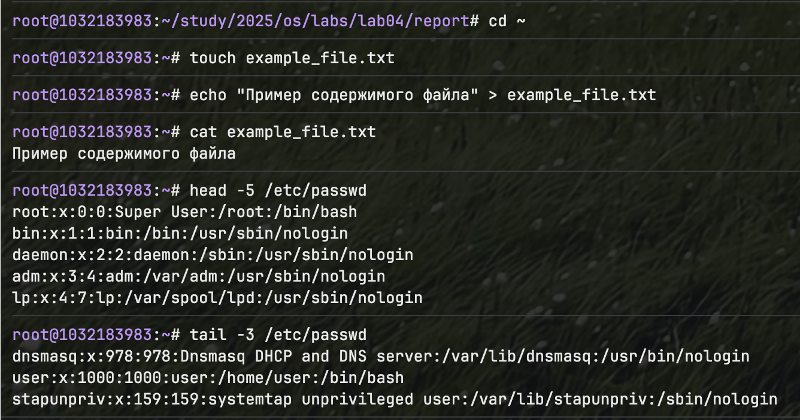
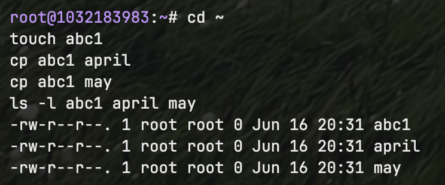
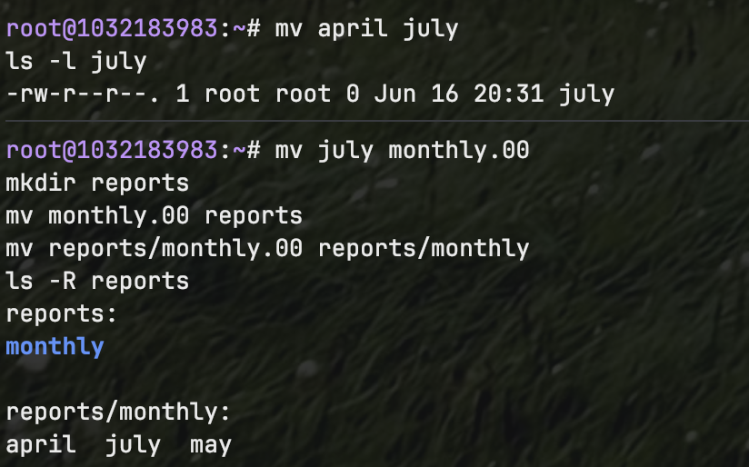
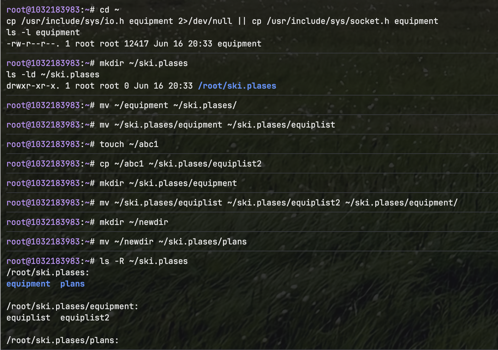
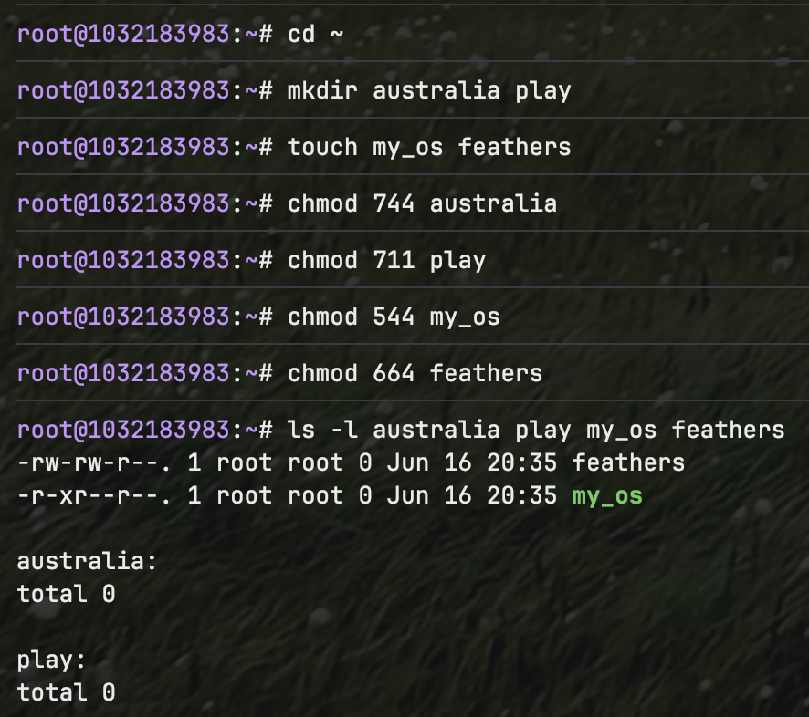
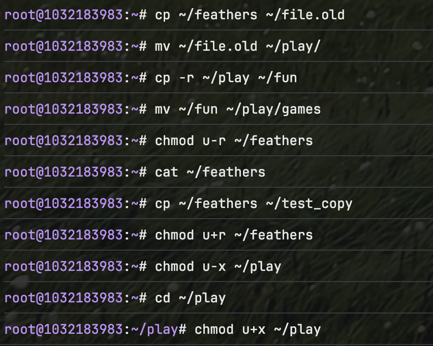
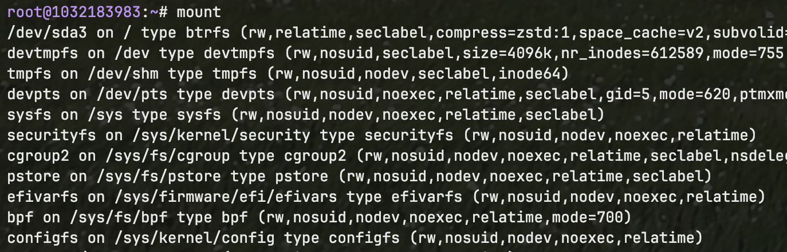

---
## Front matter
lang: ru-RU
title: Лабораторная работа №5
subtitle: Анализ файловой системы Linux. Команды для работы с файлами и каталогами
author:
  - Фёдор Симонов
institute:
  - Российский университет дружбы народов, Москва, Россия
date: 16 июня 2025

## i18n babel
babel-lang: russian
babel-otherlangs: english

## Formatting pdf
toc: false
toc-title: Содержание
slide_level: 2
aspectratio: 169
section-titles: true
theme: Madrid
header-includes:
  - \usepackage{polyglossia}
  - \setmainlanguage{russian}
  - \setotherlanguage{english}
  - \setmainfont{IBM Plex Serif}
  - \newfontfamily\cyrillicfontsf{IBM Plex Sans}
  - \newfontfamily\cyrillicfonttt{IBM Plex Mono}
---

# Цели и задачи работы

## Цель лабораторной работы

Ознакомление с файловой системой Linux, её структурой, именами и содержанием каталогов. Приобретение практических навыков по применению команд для работы с файлами и каталогами.

## Задачи

- Изучить типы файловых систем Linux
- Освоить команды создания и просмотра файлов
- Изучить операции копирования и перемещения
- Освоить управление правами доступа
- Изучить команды анализа файловой системы

# Теоретическое введение

## Файловая система Linux

:::::::::::::: {.columns align=center}
::: {.column width="50%"}

### Типы файловых систем
- **ext2/3/4** — основные ФС Linux
- **ReiserFS** — для мелких файлов
- **xfs** — высокопроизводительная
- **fat/ntfs** — совместимость

:::
::: {.column width="50%"}

### Команды для файлов
- `touch` — создание файлов
- `cat` — просмотр содержимого
- `cp` — копирование
- `mv` — перемещение/переименование

:::
::::::::::::::

## Права доступа

Каждый файл имеет права для:
- **Владельца** (user)
- **Группы** (group)
- **Остальных** (others)

Типы прав: **r** (чтение), **w** (запись), **x** (выполнение)

# Выполнение лабораторной работы

## Основные команды для работы с файлами

Демонстрация команд `touch`, `cat`, `head`, `tail`:

```bash
cd ~
touch example_file.txt
echo "Содержимое файла" > example_file.txt
cat example_file.txt
head -5 /etc/passwd
```

{#fig:001 width=70%}

## Копирование файлов

:::::::::::::: {.columns align=center}
::: {.column width="50%"}

### Копирование в текущем каталоге
```bash
touch abc1
cp abc1 april
cp abc1 may
```

:::
::: {.column width="50%"}

### Копирование в каталог
```bash
mkdir monthly
cp april may monthly
cp -r monthly monthly.00
```

:::
::::::::::::::

{#fig:002 width=60%}

## Перемещение и переименование

Операции с командой `mv`:

```bash
mv april july
mv july monthly.00
mkdir reports
mv monthly.00 reports
mv reports/monthly.00 reports/monthly
```

{#fig:003 width=70%}

## Индивидуальные задания

Работа с каталогом `ski.plases`:

```bash
# Копирование системного файла
cp /usr/include/sys/socket.h equipment

# Создание структуры каталогов
mkdir ~/ski.plases
mv ~/equipment ~/ski.plases/
mv ~/ski.plases/equipment ~/ski.plases/equiplist

# Создание файлов и каталогов
touch ~/abc1
cp ~/abc1 ~/ski.plases/equiplist2
mkdir ~/ski.plases/equipment
```

{#fig:004 width=60%}

## Работа с правами доступа

Установка требуемых прав доступа:

```bash
mkdir australia play
touch my_os feathers

chmod 744 australia    # drwxr--r--
chmod 711 play         # drwx--x--x  
chmod 544 my_os        # -r-xr--r--
chmod 664 feathers     # -rw-rw-r--
```

{#fig:005 width=70%}

## Эксперименты с правами доступа

Тестирование влияния прав доступа:

```bash
# Лишение права чтения
chmod u-r ~/feathers
cat ~/feathers          # Ошибка доступа

# Лишение права выполнения для каталога
chmod u-x ~/play
cd ~/play               # Ошибка доступа
```

{#fig:006 width=70%}

## Анализ файловой системы

Изучение команд системного анализа:

```bash
mount                   # Просмотр ФС
man mount              # Справка по монтированию
man fsck               # Проверка ФС
man mkfs               # Создание ФС
man kill               # Завершение процессов
```

{#fig:007 width=70%}

# Результаты

## Что было изучено

- Структура файловой системы Linux
- Команды создания и просмотра файлов: `touch`, `cat`, `head`, `tail`
- Операции копирования и перемещения: `cp`, `mv`
- Система прав доступа и команда `chmod`
- Команды анализа файловой системы: `mount`, `fsck`, `mkfs`

## Полученные навыки

- Работа с файлами и каталогами в Linux
- Управление правами доступа
- Понимание структуры файловой системы
- Использование команд системного анализа
- Навыки диагностики и устранения проблем с доступом

# Выводы

## Выводы

В ходе выполнения лабораторной работы:

- Изучены основы файловой системы Linux и её типы
- Освоены команды для работы с файлами и каталогами
- Получены практические навыки управления правами доступа
- Изучены команды анализа и обслуживания файловой системы
- Понято влияние прав доступа на операции с файлами

## Спасибо за внимание!