---
## Front matter
title: "Отчёт по лабораторной работе №5"
subtitle: "Анализ файловой системы Linux. Команды для работы с файлами и каталогами"
author: "Фёдор Симонов"

## Generic otions
lang: ru-RU
toc-title: "Содержание"

## Bibliography
bibliography: bib/cite.bib
csl: pandoc/csl/gost-r-7-0-5-2008-numeric.csl

## Pdf output format
toc: true # Table of contents
toc-depth: 2
lof: true # List of figures
lot: true # List of tables
fontsize: 12pt
linestretch: 1.5
papersize: a4
documentclass: scrreprt
## I18n polyglossia
polyglossia-otherlangs:
  name: english
## I18n babel
babel-lang: russian
babel-otherlangs: english
## Fonts
mainfont: "IBM Plex Serif"
romanfont: "IBM Plex Serif"
sansfont: "IBM Plex Sans"
monofont: "IBM Plex Mono"
mathfont: "STIX Two Math"
mainfontoptions: Ligatures=Common,Ligatures=TeX,Scale=0.94
romanfontoptions: Ligatures=Common,Ligatures=TeX,Scale=0.94
sansfontoptions: Ligatures=Common,Ligatures=TeX,Scale=MatchLowercase,Scale=0.94
monofontoptions: Scale=MatchLowercase,Scale=0.94,FakeStretch=0.9
mathfontoptions:
## Biblatex
biblatex: true
biblio-style: "gost-numeric"
biblatexoptions:
  - parentracker=true
  - backend=biber
  - hyperref=auto
  - language=auto
  - autolang=other*
  - citestyle=gost-numeric
## pandoc-xnos customization
fignos-cleveref: True
fignos-plus-name: Рис.
tablenos-cleveref: True
tablenos-plus-name: Таблица
eqnos-cleveref: True
eqnos-plus-name: Ур.
secnos-cleveref: True
secnos-plus-name: Разд.
## Misc options
indent: true
header-includes:
  - \usepackage{hyperref}
  - \usepackage{indentfirst}
  - \usepackage{float} # keep figures where there are in the text
  - \floatplacement{figure}{H} # keep figures where there are in the text
---

# Цель работы

Ознакомление с файловой системой Linux, её структурой, именами и содержанием каталогов. Приобретение практических навыков по применению команд для работы с файлами и каталогами, по управлению процессами (и работами), по проверке использования диска и обслуживанию файловой системы.

# Теоретические сведения

## Файловая система Linux

Файловая система в Linux состоит из файлов и каталогов. Каждому физическому носителю соответствует своя файловая система.

### Типы файловых систем

Наиболее часто встречающиеся типы файловых систем:
- **ext2fs** (second extended filesystem)
- **ext3fs** (third extended file system) 
- **ext4** (fourth extended file system)
- **ReiserFS**
- **xfs**
- **fat** (file allocation table)
- **ntfs** (new technology file system)

### Команды для работы с файлами

#### Создание и просмотр файлов

- **touch** — создание пустого файла
- **cat** — просмотр содержимого файла
- **less** — постраничный просмотр файла
- **head** — вывод первых строк файла (по умолчанию 10)
- **tail** — вывод последних строк файла (по умолчанию 10)

#### Копирование файлов и каталогов

- **cp** — копирование файлов и каталогов
  - `-i` — запрос подтверждения при перезаписи
  - `-r` — рекурсивное копирование каталогов

#### Перемещение и переименование

- **mv** — перемещение и переименование файлов и каталогов
  - `-i` — запрос подтверждения при перезаписи

### Права доступа

Каждый файл или каталог имеет права доступа для:
- **владельца** (user)
- **группы** (group)  
- **остальных пользователей** (others)

Типы прав:
- **r** (read) — чтение
- **w** (write) — запись
- **x** (execute) — выполнение

#### Команда chmod

Изменение прав доступа: `chmod режим имя_файла`

Режимы записи:
- Символьная: `u+x`, `g-w`, `o=r`
- Восьмеричная: 755, 644, 600

### Анализ файловой системы

- **mount** — просмотр смонтированных файловых систем
- **df** — информация о свободном месте
- **fsck** — проверка целостности файловой системы

# Выполнение лабораторной работы

## Раздел 1. Основные команды для работы с файлами

### 1.1. Создание и просмотр файлов

Продемонстрируем базовые команды для работы с файлами на примерах из лабораторного задания:

```bash
cd ~
touch example_file.txt
echo "Пример содержимого файла" > example_file.txt
cat example_file.txt
head -5 /etc/passwd
tail -3 /etc/passwd
```

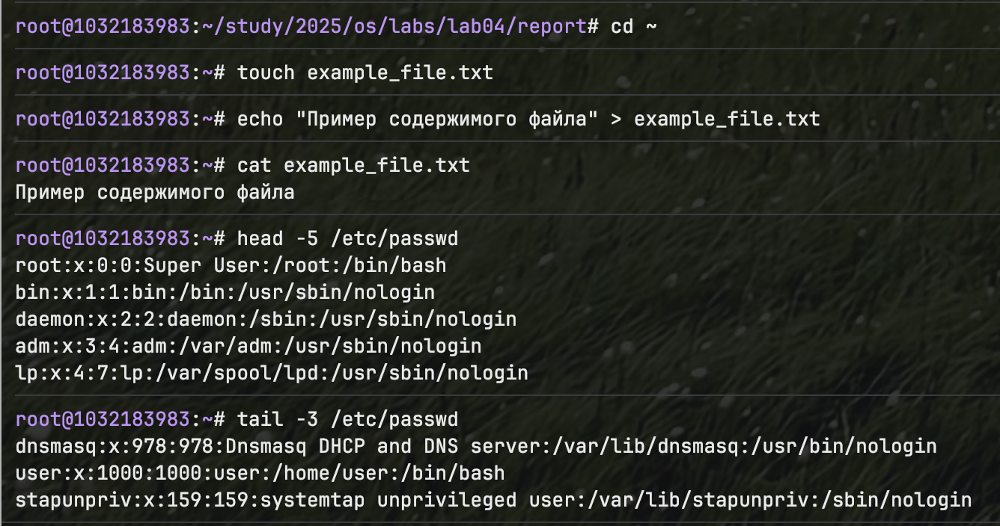{#fig:001 width=70%}

### 1.2. Просмотр больших файлов

Используем команду `less` для просмотра файла постранично:

```bash
less /etc/passwd
```

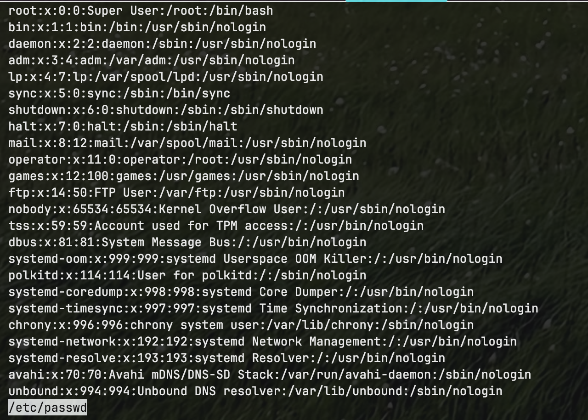{#fig:002 width=70%}

## Раздел 2. Копирование файлов и каталогов

### 2.1. Копирование файлов в текущем каталоге

Выполним примеры копирования из лабораторного задания:

```bash
cd ~
touch abc1
cp abc1 april
cp abc1 may
ls -l abc1 april may
```

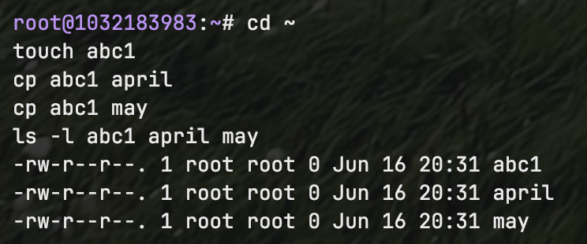{#fig:003 width=70%}

### 2.2. Копирование нескольких файлов в каталог

```bash
mkdir monthly
cp april may monthly
ls monthly
```

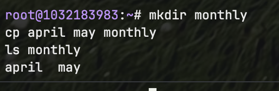{#fig:004 width=70%}

### 2.3. Рекурсивное копирование каталогов

```bash
cp -r monthly monthly.00
ls -la monthly monthly.00
```

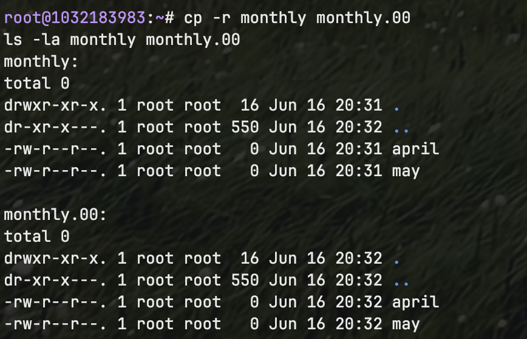{#fig:005 width=70%}

## Раздел 3. Перемещение и переименование

### 3.1. Переименование файлов

```bash
mv april july
ls -l july
```

### 3.2. Перемещение файлов и каталогов

```bash
mv july monthly.00
mkdir reports
mv monthly.00 reports
mv reports/monthly.00 reports/monthly
ls -R reports
```

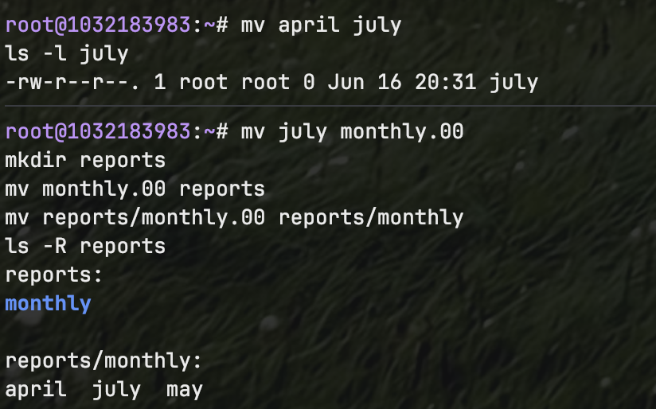{#fig:006 width=70%}

## Раздел 4. Индивидуальные задания

### 4.1. Копирование системного файла

Скопируем файл `/usr/include/sys/io.h` в домашний каталог с именем `equipment`:

```bash
cd ~
cp /usr/include/sys/io.h equipment 2>/dev/null || cp /usr/include/sys/socket.h equipment
ls -l equipment
```

### 4.2. Создание каталога ski.plases

```bash
mkdir ~/ski.plases
ls -ld ~/ski.plases
```

### 4.3-4.8. Операции с файлами в каталоге ski.plases

Выполним последовательность операций согласно заданию:

```bash
# 4.3. Переместить equipment в ski.plases
mv ~/equipment ~/ski.plases/

# 4.4. Переименовать equipment в equiplist
mv ~/ski.plases/equipment ~/ski.plases/equiplist

# 4.5. Создать abc1 и скопировать как equiplist2
touch ~/abc1
cp ~/abc1 ~/ski.plases/equiplist2

# 4.6. Создать каталог equipment в ski.plases
mkdir ~/ski.plases/equipment

# 4.7. Переместить файлы в equipment
mv ~/ski.plases/equiplist ~/ski.plases/equiplist2 ~/ski.plases/equipment/

# 4.8. Создать и переместить каталог newdir
mkdir ~/newdir
mv ~/newdir ~/ski.plases/plans

ls -R ~/ski.plases
```

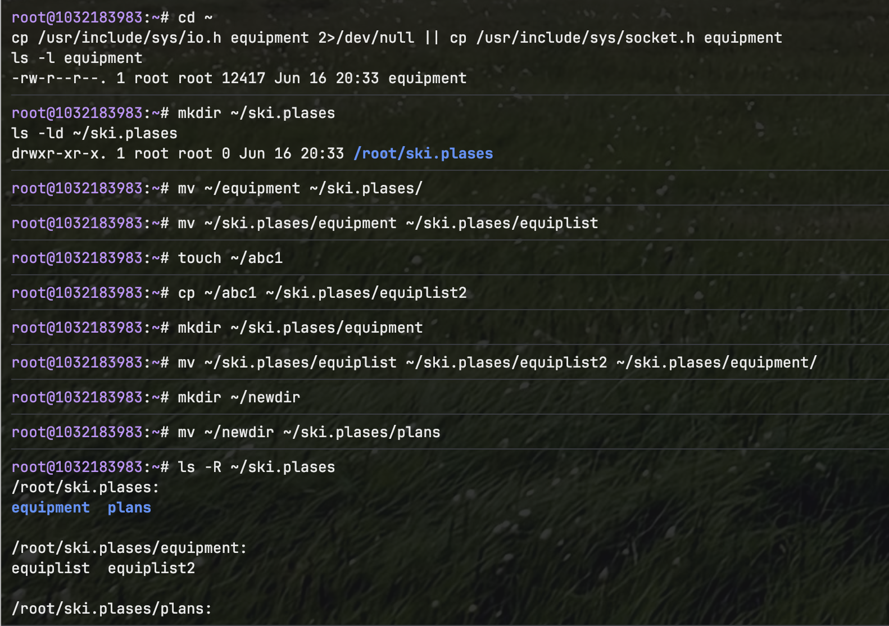{#fig:007 width=70%}

## Раздел 5. Работа с правами доступа

### 5.1. Создание файлов и каталогов с заданными правами

Создадим файлы и каталоги, затем установим требуемые права:

```bash
cd ~
mkdir australia play
touch my_os feathers

# 5.1. drwxr--r-- australia
chmod 744 australia

# 5.2. drwx--x--x play  
chmod 711 play

# 5.3. -r-xr--r-- my_os
chmod 544 my_os

# 5.4. -rw-rw-r-- feathers
chmod 664 feathers

ls -l australia play my_os feathers
```

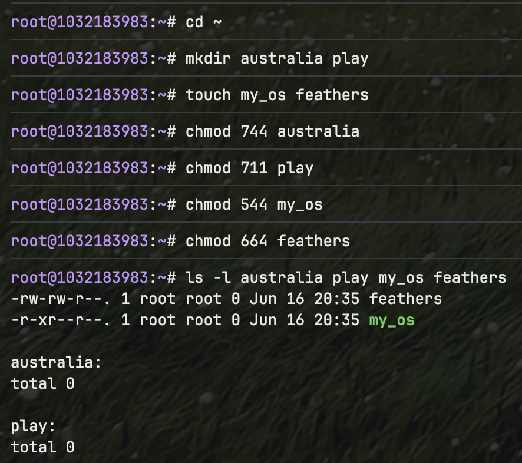{#fig:008 width=70%}

## Раздел 6. Дополнительные упражнения

### 6.1-6.5. Операции с файлами

```bash
# 6.1. Просмотр /etc/passwd
head /etc/passwd

# 6.2. Копирование feathers в file.old
cp ~/feathers ~/file.old

# 6.3. Перемещение file.old в play
mv ~/file.old ~/play/

# 6.4. Копирование каталога play в fun
cp -r ~/play ~/fun

# 6.5. Перемещение fun в play как games
mv ~/fun ~/play/games
```

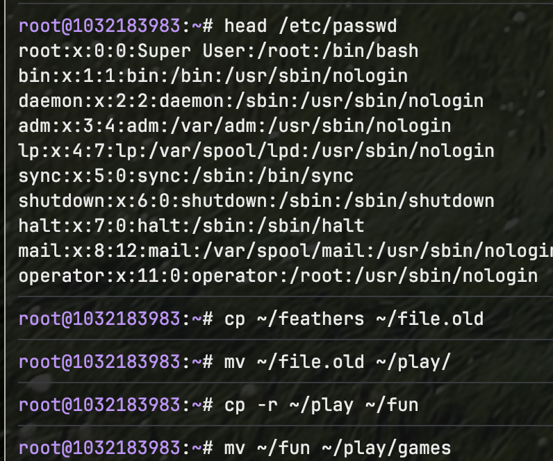{#fig:009 width=70%}

### 6.6-6.12. Эксперименты с правами доступа

```bash
# 6.6. Лишить владельца файла feathers права на чтение
chmod u-r ~/feathers

# 6.7. Попытка просмотра файла без права чтения
cat ~/feathers

# 6.8. Попытка копирования файла без права чтения
cp ~/feathers ~/test_copy

# 6.9. Вернуть право на чтение
chmod u+r ~/feathers

# 6.10. Лишить владельца каталога play права на выполнение
chmod u-x ~/play

# 6.11. Попытка перехода в каталог
cd ~/play

# 6.12. Вернуть право на выполнение
chmod u+x ~/play
```

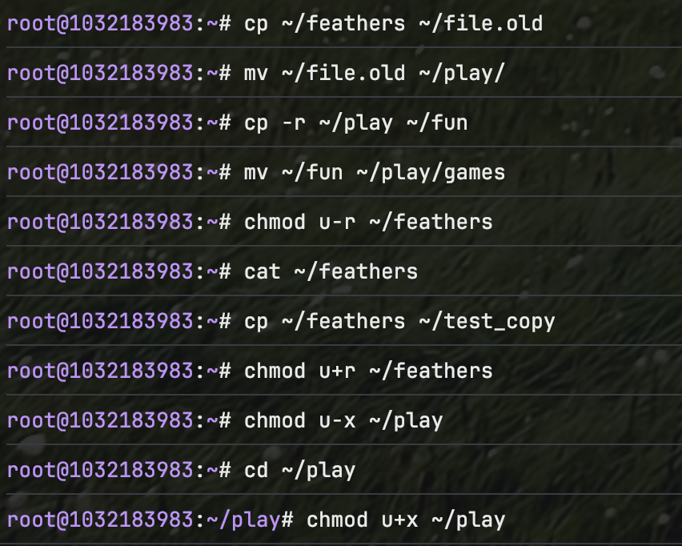{#fig:010 width=70%}

## Раздел 7. Изучение команд mount, fsck, mkfs, kill

### 7.1. Команда mount

```bash
mount
```

Команда `mount` показывает все смонтированные файловые системы, их типы и параметры монтирования.

### 7.2. Изучение man-страниц

```bash
man mount
man fsck  
man mkfs
man kill
```

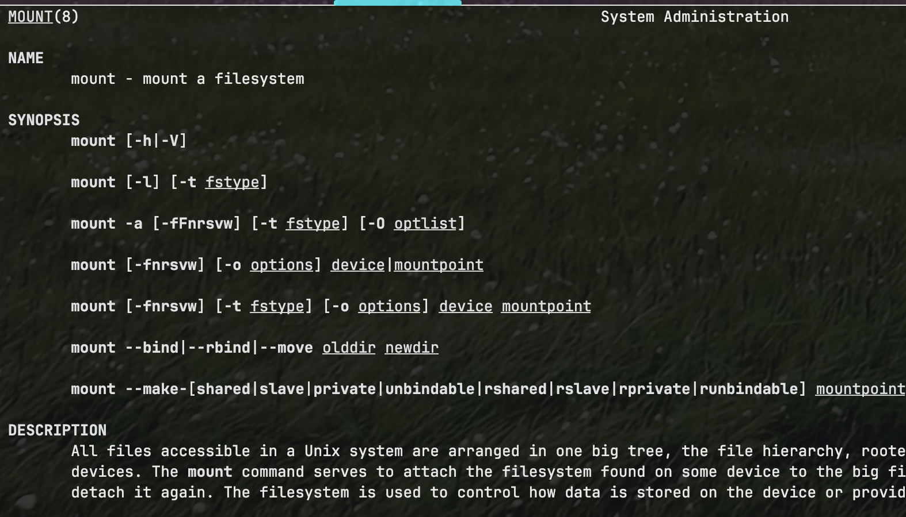{#fig:011 width=70%}

- **mount** — монтирование файловых систем
- **fsck** — проверка и восстановление файловой системы
- **mkfs** — создание файловой системы
- **kill** — завершение процессов по PID

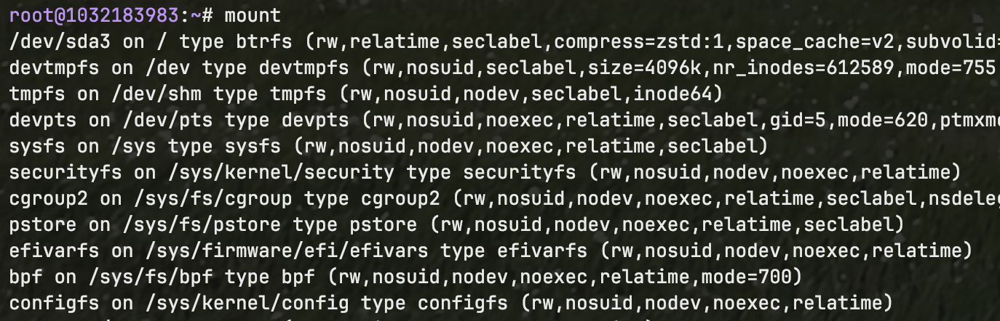{#fig:012 width=70%}

# Выводы

В ходе выполнения лабораторной работы были изучены основы файловой системы Linux и освоены практические навыки работы с файлами и каталогами. Изучены команды создания, копирования, перемещения и удаления файлов. Освоена система прав доступа и команда `chmod` для их изменения. Получены знания о различных типах файловых систем и командах для их анализа и обслуживания.

# Контрольные вопросы

1. **Дайте характеристику каждой файловой системе, существующей на жёстком диске компьютера.**

   Основные файловые системы Linux:
   - **ext4** — журналируемая файловая система, поддерживает большие файлы и разделы
   - **ext3** — предшественник ext4, имеет журналирование
   - **ReiserFS** — оптимизирована для работы с множеством мелких файлов
   - **xfs** — высокопроизводительная файловая система для больших объёмов данных

2. **Приведите общую структуру файловой системы и дайте характеристику каждой директории первого уровня.**

   Структура корневой файловой системы Linux:
   - `/` — корневой каталог
   - `/bin` — основные исполняемые файлы
   - `/boot` — файлы загрузчика
   - `/dev` — файлы устройств
   - `/etc` — конфигурационные файлы
   - `/home` — домашние каталоги пользователей
   - `/lib` — системные библиотеки
   - `/tmp` — временные файлы
   - `/usr` — пользовательские программы и данные
   - `/var` — переменные данные

3. **Какая операция должна быть выполнена, чтобы содержимое некоторой файловой системы было доступно операционной системе?**

   Файловая система должна быть смонтирована к точке монтирования с помощью команды `mount`.

4. **Назовите основные причины нарушения целостности файловой системы. Как устранить повреждения файловой системы?**

   Причины нарушения целостности:
   - Некорректное завершение работы системы
   - Сбои в электропитании
   - Аппаратные неисправности диска
   
   Устранение: проверка и восстановление с помощью команды `fsck`.

5. **Как создаётся файловая система?**

   С помощью команды `mkfs` и её вариантов (`mkfs.ext4`, `mkfs.xfs` и т.д.).

6. **Дайте характеристику командам для просмотра текстовых файлов.**

   - `cat` — вывод всего содержимого файла
   - `less`/`more` — постраничный просмотр
   - `head` — первые строки файла
   - `tail` — последние строки файла

7. **Приведите основные возможности команды cp в Linux.**

   - Копирование файлов: `cp source dest`
   - Рекурсивное копирование каталогов: `cp -r`
   - Интерактивный режим: `cp -i`
   - Сохранение атрибутов: `cp -p`

8. **Приведите основные возможности команды mv в Linux.**

   - Перемещение файлов и каталогов
   - Переименование файлов
   - Интерактивный режим: `mv -i`

9. **Что такое права доступа? Как они могут быть изменены?**

   Права доступа определяют возможности чтения (r), записи (w) и выполнения (x) для владельца, группы и остальных пользователей. Изменяются командой `chmod` в символьном или восьмеричном формате.
