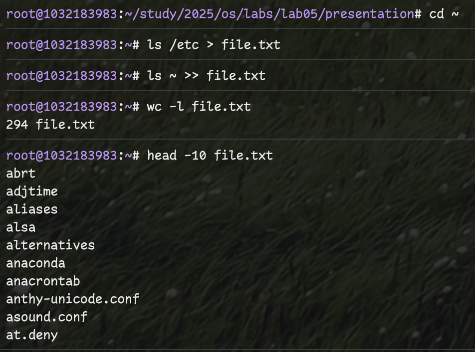
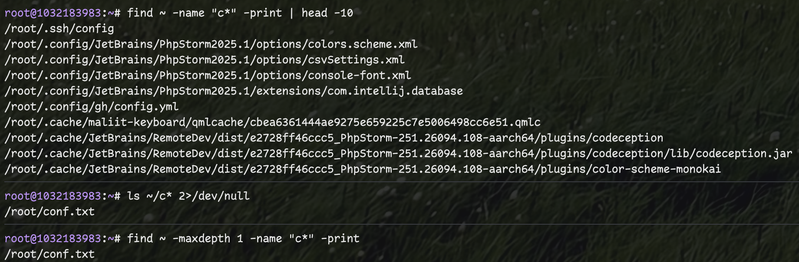
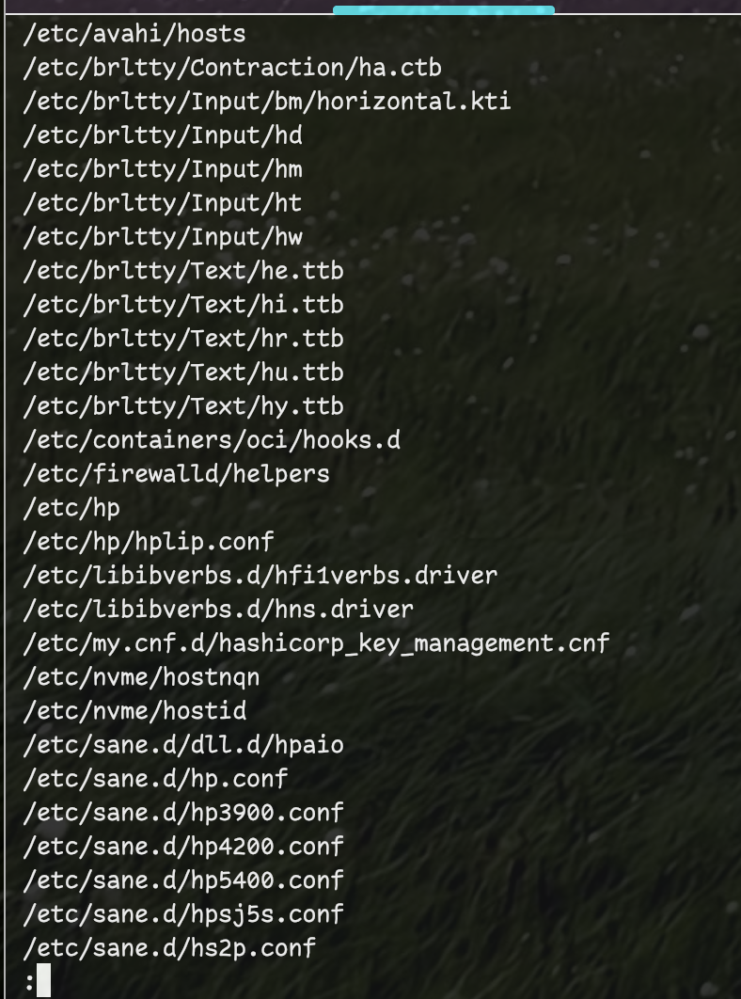
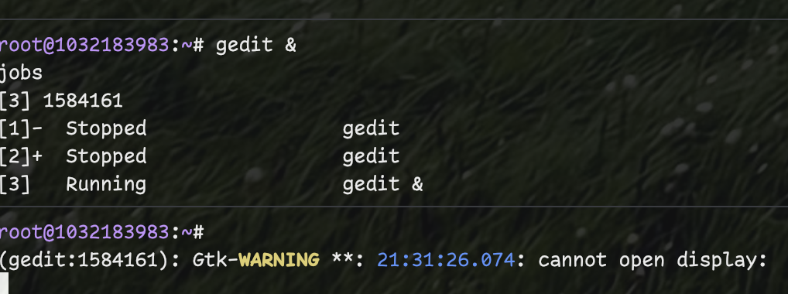
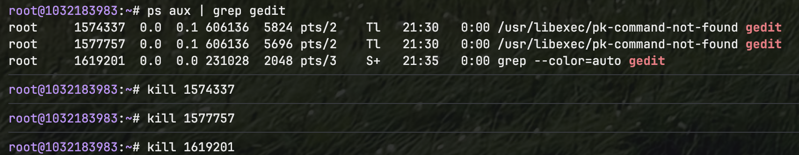
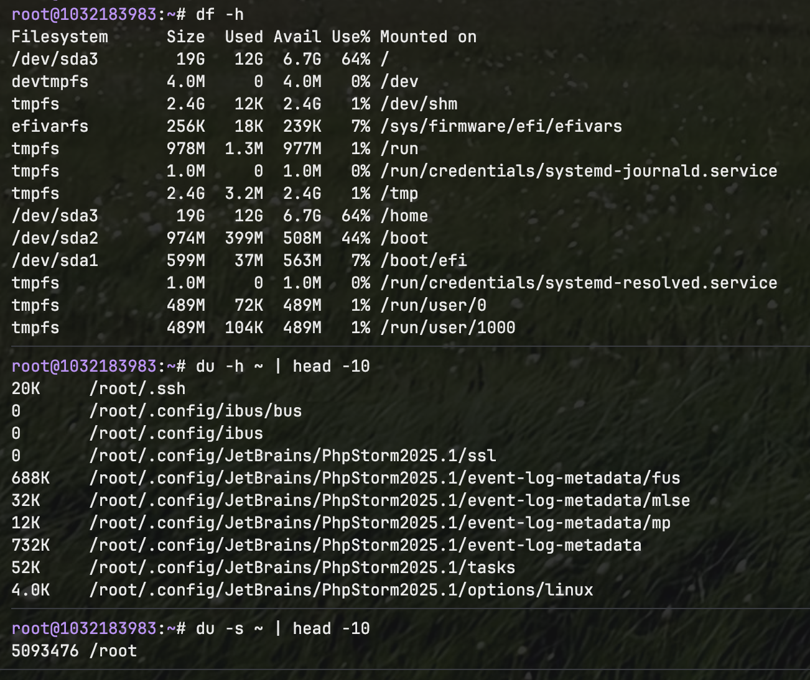

---
## Front matter
lang: ru-RU
title: Лабораторная работа №6
subtitle: Поиск файлов. Перенаправление ввода-вывода. Просмотр запущенных процессов
author:
  - Фёдор Симонов
institute:
  - Российский университет дружбы народов, Москва, Россия
date: 16 июня 2025

## i18n babel
babel-lang: russian
babel-otherlangs: english

## Formatting pdf
toc: false
toc-title: Содержание
slide_level: 2
aspectratio: 169
section-titles: true
theme: Madrid
header-includes:
  - \usepackage{polyglossia}
  - \setmainlanguage{russian}
  - \setotherlanguage{english}
  - \setmainfont{IBM Plex Serif}
  - \newfontfamily\cyrillicfontsf{IBM Plex Sans}
  - \newfontfamily\cyrillicfonttt{IBM Plex Mono}
---

# Цели и задачи работы

## Цель лабораторной работы

Ознакомление с инструментами поиска файлов и фильтрации текстовых данных. Приобретение практических навыков по управлению процессами и заданиями, проверке использования диска и обслуживанию файловых систем.

## Задачи

- Изучить принципы перенаправления ввода-вывода
- Освоить использование конвейеров (pipes)
- Изучить команды поиска файлов (find, grep)
- Освоить управление процессами и заданиями
- Изучить команды анализа дискового пространства

# Теоретическое введение

## Перенаправление ввода-вывода

:::::::::::::: {.columns align=center}
::: {.column width="50%"}

### Стандартные потоки
- **stdin** (0) — ввод
- **stdout** (1) — вывод  
- **stderr** (2) — ошибки

:::
::: {.column width="50%"}

### Операторы
- `>` — перезапись файла
- `>>` — добавление в файл
- `|` — конвейер
- `2>` — перенаправление ошибок

:::
::::::::::::::

## Поиск файлов

:::::::::::::: {.columns align=center}
::: {.column width="50%"}

### Команда find
```bash
find путь -name "шаблон"
find ~ -type f
find /etc -name "*.conf"
```

:::
::: {.column width="50%"}

### Команда grep
```bash
grep "pattern" файл
ls -l | grep pattern
find . -exec grep -l "text" {} \;
```

:::
::::::::::::::

## Управление процессами

Основные команды:
- `jobs` — список активных заданий
- `ps` — информация о процессах
- `kill PID` — завершение по идентификатору
- `команда &` — запуск в фоне

# Выполнение лабораторной работы

## Задание 2-3. Работа со списками файлов

Создание списков и фильтрация:

```bash
# Запись списков файлов
ls /etc > file.txt
ls ~ >> file.txt

# Фильтрация файлов .conf
grep "\.conf$" file.txt > conf.txt
```

{#fig:001 width=70%}

## Задание 4. Поиск файлов по маске

Несколько способов поиска файлов, начинающихся с 'c':

```bash
# Вариант 1: find
find ~ -name "c*" -print

# Вариант 2: глобы
ls ~/c* 2>/dev/null

# Вариант 3: ограниченная глубина
find ~ -maxdepth 1 -name "c*"
```

{#fig:002 width=60%}

## Задание 5-6. Поиск и фоновые процессы

:::::::::::::: {.columns align=center}
::: {.column width="50%"}

### Постраничный вывод
```bash
find /etc -name "h*" \
  2>/dev/null | less
```

:::
::: {.column width="50%"}

### Фоновый поиск
```bash
find /var/log -name "log*" \
  > ~/logfile 2>/dev/null &
jobs
```

:::
::::::::::::::

{#fig:003 width=70%}

## Задание 7-9. Управление процессами

Работа с процессами gedit:

```bash
# Запуск в фоне
gedit &

# Поиск PID
ps aux | grep gedit
pgrep gedit

# Альтернативы
pidof gedit
ps -C gedit
```

{#fig:004 width=60%}

## Задание 10. Завершение процессов

Изучение и применение команды kill:

```bash
# Изучение справки
man kill

# Завершение процесса
kill [PID]

# Проверка завершения
ps aux | grep gedit
```

{#fig:005 width=70%}

## Задание 11-12. Анализ дискового пространства

:::::::::::::: {.columns align=center}
::: {.column width="50%"}

### Команда df
```bash
df -h    # размер разделов
df -i    # информация об inodes
```

:::
::: {.column width="50%"}

### Команда du
```bash
du -sh ~  # размер каталога
du -h ~   # детальная информация
```

:::
::::::::::::::

### Поиск директорий
```bash
find ~ -type d -print
find ~ -type d | wc -l
```

{#fig:006 width=70%}

# Дополнительные возможности

## Комбинирование команд

Примеры сложных операций:

```bash
# Поиск конфигурационных файлов
find /usr -name "*.conf" 2>/dev/null | head -20

# Поиск bash-процессов
ps aux | grep -v grep | grep bash

# Подсчет директорий
ls -la | grep "^d" | wc -l
```

{#fig:007 width=70%}

# Результаты

## Что было изучено

- Принципы перенаправления ввода-вывода: `>`, `>>`, `|`, `2>`
- Команды поиска файлов: `find`, `grep`
- Управление процессами: `ps`, `jobs`, `kill`, `pgrep`
- Анализ дискового пространства: `df`, `du`
- Фоновое выполнение команд с `&`

## Полученные навыки

- Эффективный поиск файлов по различным критериям
- Фильтрация текстовых данных с помощью конвейеров
- Управление процессами и заданиями в Linux
- Мониторинг использования дискового пространства
- Автоматизация задач через комбинирование команд

# Выводы

## Выводы

В ходе выполнения лабораторной работы:

- Освоены инструменты поиска файлов и фильтрации данных
- Изучены принципы перенаправления ввода-вывода
- Получены навыки управления процессами и заданиями
- Освоены команды анализа файловой системы
- Понято применение конвейеров для обработки данных

## Спасибо за внимание!