---
## Front matter
title: "Отчёт по лабораторной работе №6"
subtitle: "Поиск файлов. Перенаправление ввода-вывода. Просмотр запущенных процессов"
author: "Фёдор Симонов"

## Generic otions
lang: ru-RU
toc-title: "Содержание"

## Bibliography
bibliography: bib/cite.bib
csl: pandoc/csl/gost-r-7-0-5-2008-numeric.csl

## Pdf output format
toc: true # Table of contents
toc-depth: 2
lof: true # List of figures
lot: true # List of tables
fontsize: 12pt
linestretch: 1.5
papersize: a4
documentclass: scrreprt
## I18n polyglossia
polyglossia-otherlangs:
  name: english
## I18n babel
babel-lang: russian
babel-otherlangs: english
## Fonts
mainfont: "IBM Plex Serif"
romanfont: "IBM Plex Serif"
sansfont: "IBM Plex Sans"
monofont: "IBM Plex Mono"
mathfont: "STIX Two Math"
mainfontoptions: Ligatures=Common,Ligatures=TeX,Scale=0.94
romanfontoptions: Ligatures=Common,Ligatures=TeX,Scale=0.94
sansfontoptions: Ligatures=Common,Ligatures=TeX,Scale=MatchLowercase,Scale=0.94
monofontoptions: Scale=MatchLowercase,Scale=0.94,FakeStretch=0.9
mathfontoptions:
## Biblatex
biblatex: true
biblio-style: "gost-numeric"
biblatexoptions:
  - parentracker=true
  - backend=biber
  - hyperref=auto
  - language=auto
  - autolang=other*
  - citestyle=gost-numeric
## pandoc-xnos customization
fignos-cleveref: True
fignos-plus-name: Рис.
tablenos-cleveref: True
tablenos-plus-name: Таблица
eqnos-cleveref: True
eqnos-plus-name: Ур.
secnos-cleveref: True
secnos-plus-name: Разд.
## Misc options
indent: true
header-includes:
  - \usepackage{hyperref}
  - \usepackage{indentfirst}
  - \usepackage{float} # keep figures where there are in the text
  - \floatplacement{figure}{H} # keep figures where there are in the text
---

# Цель работы

Ознакомление с инструментами поиска файлов и фильтрации текстовых данных. Приобретение практических навыков: по управлению процессами (и заданиями), по проверке использования диска и обслуживанию файловых систем.

# Теоретические сведения

## Перенаправление ввода-вывода

В системе по умолчанию открыто три специальных потока:
- **stdin** — стандартный поток ввода (файловый дескриптор 0)
- **stdout** — стандартный поток вывода (файловый дескриптор 1)
- **stderr** — стандартный поток вывода ошибок (файловый дескриптор 2)

### Операторы перенаправления

- `>` — перенаправление stdout в файл (перезапись)
- `>>` — перенаправление stdout в файл (добавление)
- `<` — перенаправление stdin из файла
- `2>` — перенаправление stderr в файл
- `&>` — перенаправление stdout и stderr в файл

## Конвейер (pipe)

Конвейер служит для объединения команд в цепочки:
```bash
команда1 | команда2 | команда3
```
Вывод предыдущей команды передается на ввод следующей.

## Поиск файлов

### Команда find

Используется для поиска файлов по различным критериям:
```bash
find путь [опции]
```

Основные опции:
- `-name "pattern"` — поиск по имени
- `-type f` — только файлы
- `-type d` — только каталоги
- `-exec команда {} \;` — выполнить команду для найденных файлов
- `-print` — вывести результаты

## Фильтрация текста

### Команда grep

Поиск строк в текстовых файлах:
```bash
grep шаблон файл
```

Может работать с выводом других команд через конвейер:
```bash
ls -l | grep pattern
```

## Управление процессами и заданиями

### Фоновое выполнение

Запуск команды в фоновом режиме:
```bash
команда &
```

### Управление заданиями

- **jobs** — список активных заданий
- **kill %номер** — завершение задания по номеру

### Управление процессами

- **ps** — информация о процессах
- **kill PID** — завершение процесса по идентификатору
- **pgrep** — поиск процессов по имени

## Проверка использования диска

### Команда df

Показывает размер смонтированных разделов:
```bash
df [-опции] [файловая_система]
```

### Команда du

Показывает использование диска файлами и каталогами:
```bash
du [-опции] [имя_файла...]
```

# Выполнение лабораторной работы

## Задание 2. Создание списков файлов

Запишем в файл `file.txt` названия файлов из каталога `/etc`, затем допишем названия файлов из домашнего каталога:

```bash
ls /etc > file.txt
ls ~ >> file.txt
wc -l file.txt
head -10 file.txt
```

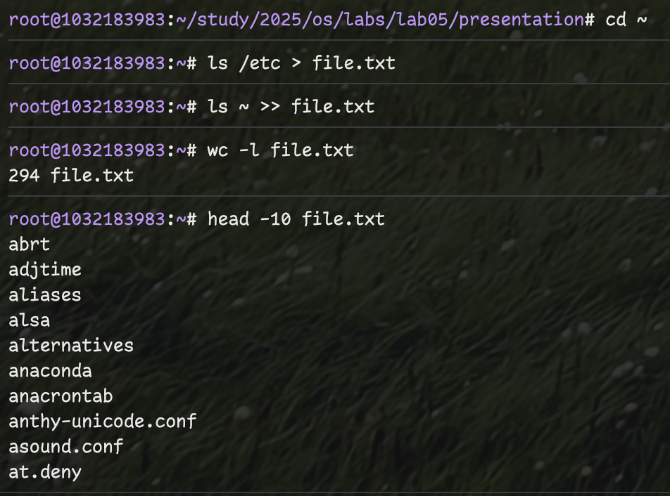{#fig:001 width=70%}

## Задание 3. Фильтрация файлов с расширением .conf

Выведем имена всех файлов из `file.txt`, имеющих расширение `.conf`, и запишем их в новый файл `conf.txt`:

```bash
grep "\.conf$" file.txt > conf.txt
cat conf.txt
wc -l conf.txt
```

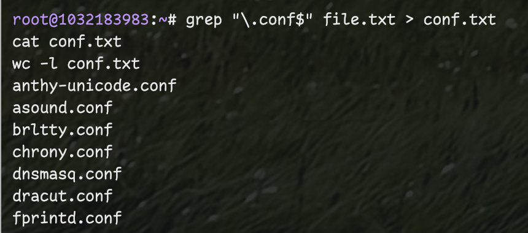{#fig:002 width=70%}

## Задание 4. Поиск файлов, начинающихся с символа 'c'

Определим файлы в домашнем каталоге, имена которых начинаются с символа `c`. Несколько вариантов решения:

### Вариант 1: Команда find
```bash
find ~ -name "c*" -print
```

### Вариант 2: Подстановка шаблонов в ls
```bash
ls ~/c* 2>/dev/null
```

### Вариант 3: find с ограничением глубины
```bash
find ~ -maxdepth 1 -name "c*" -print
```

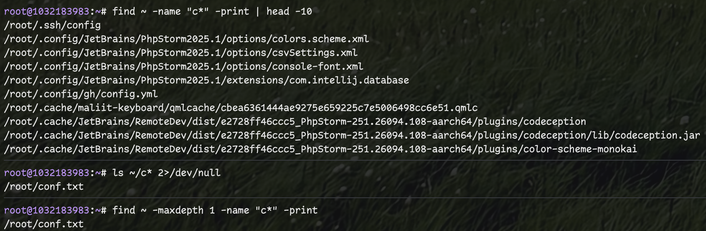{#fig:003 width=70%}

## Задание 5. Постраничный вывод файлов из /etc

Выведем на экран (по страницам) имена файлов из каталога `/etc`, начинающиеся с символа `h`:

```bash
find /etc -name "h*" -print 2>/dev/null | less
```

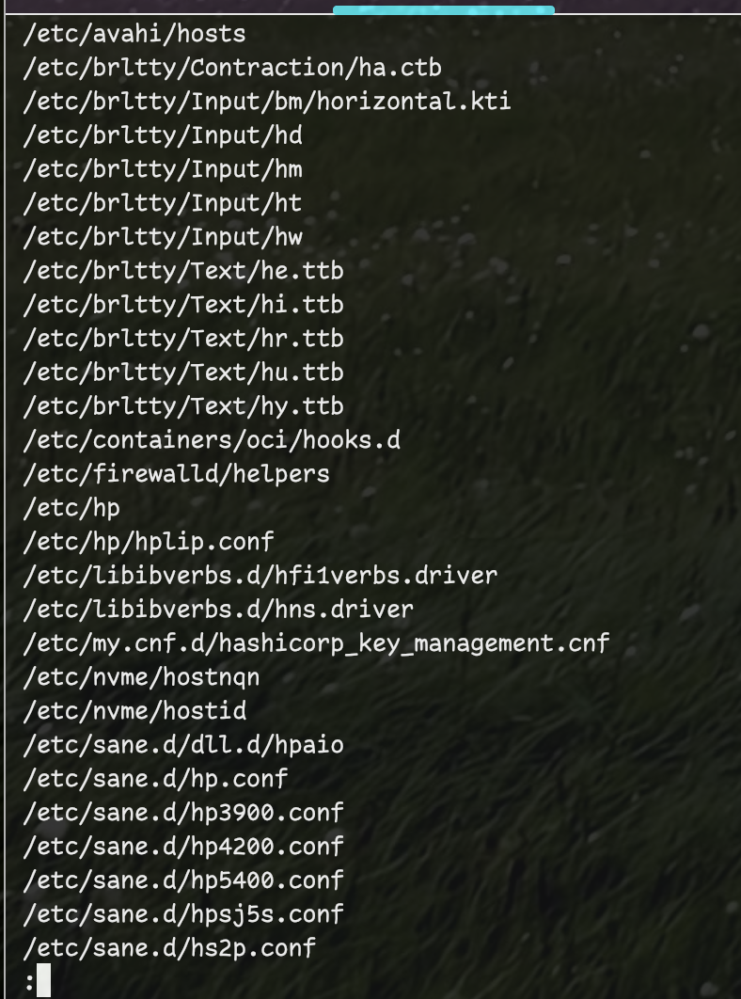{#fig:004 width=70%}

## Задание 6. Фоновый процесс поиска log-файлов

Запустим в фоновом режиме процесс, который будет записывать в файл `~/logfile` файлы, имена которых начинаются с `log`:

```bash
find /var/log -name "log*" -print > ~/logfile 2>/dev/null &
jobs
cat ~/logfile
```

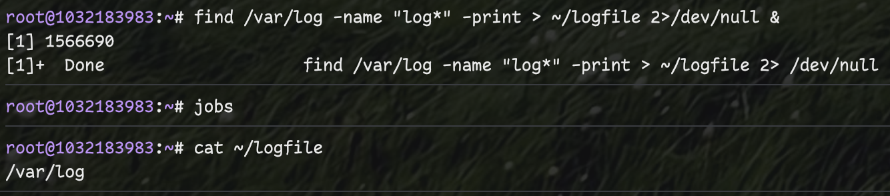{#fig:005 width=70%}

## Задание 7. Удаление файла logfile

Удалим файл `~/logfile`:

```bash
rm ~/logfile
ls -l ~/logfile
```

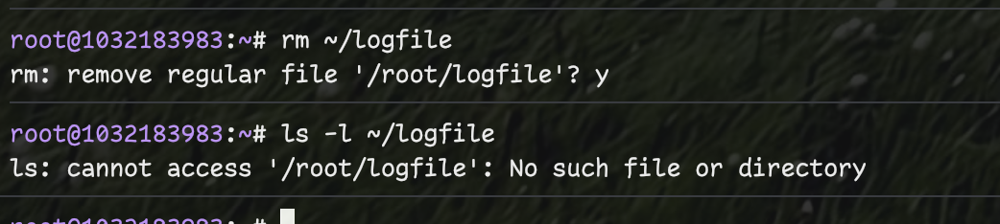{#fig:006 width=70%}

## Задание 8. Запуск gedit в фоновом режиме

Запустим из консоли в фоновом режиме редактор `gedit`:

```bash
gedit &
jobs
```

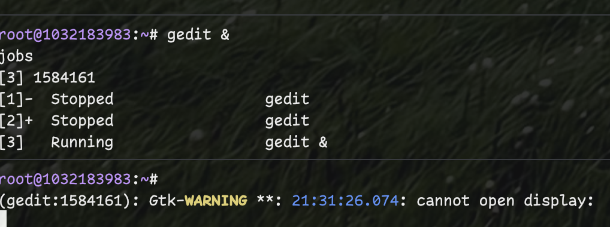{#fig:007 width=70%}

## Задание 9. Определение PID процесса gedit

Определим идентификатор процесса `gedit`, используя команду `ps`, конвейер и фильтр `grep`:

```bash
ps aux | grep gedit
pgrep gedit
```

Альтернативные способы определения PID:
- `pidof gedit`
- `ps -C gedit`
- `pgrep -f gedit`

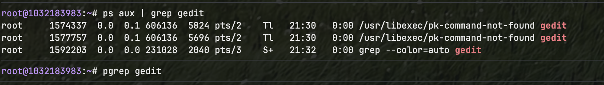{#fig:008 width=70%}

## Задание 10. Завершение процесса gedit

Изучим справку команды `kill` и используем её для завершения процесса `gedit`:

```bash
man kill
kill [PID]
ps aux | grep gedit
```

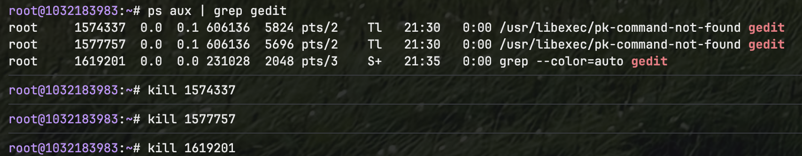{#fig:009 width=70%}

## Задание 11. Команды df и du

Выполним команды `df` и `du`, предварительно изучив их справку:

```bash
man df
man du
df -h
du -h ~
du -s ~
```

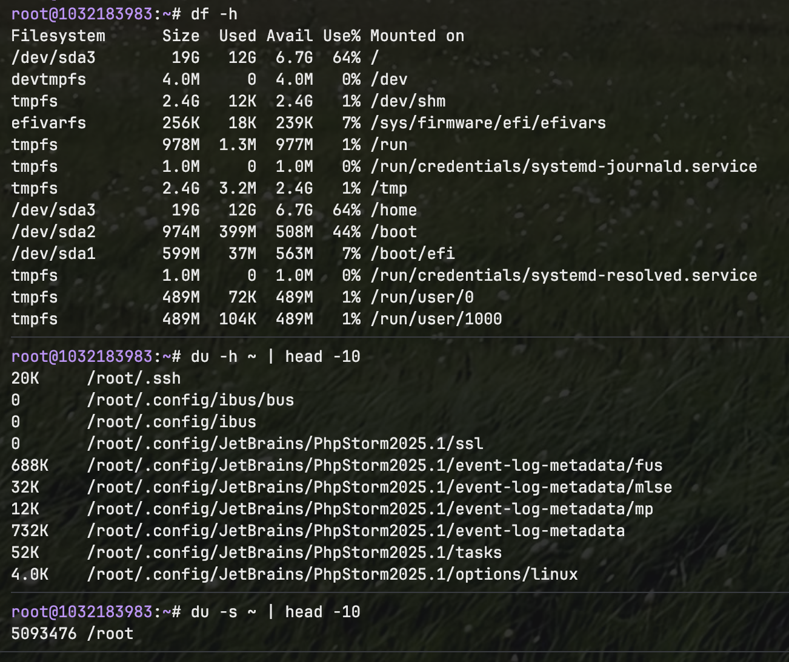{#fig:010 width=70%}

## Задание 12. Поиск директорий в домашнем каталоге

Воспользуемся справкой команды `find` и выведем имена всех директорий в домашнем каталоге:

```bash
man find
find ~ -type d -print
find ~ -type d | wc -l
```

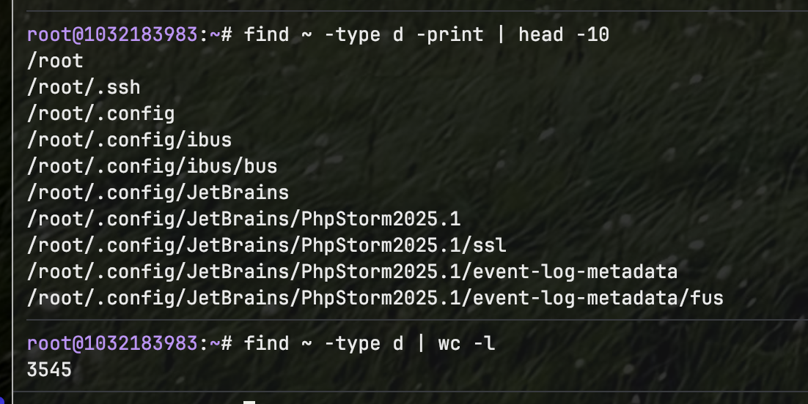{#fig:011 width=70%}

## Дополнительные примеры работы с командами

### Комбинирование команд поиска и фильтрации

```bash
find /usr -name "*.conf" -print 2>/dev/null | head -20
ps aux | grep -v grep | grep bash
ls -la | grep "^d" | wc -l
```

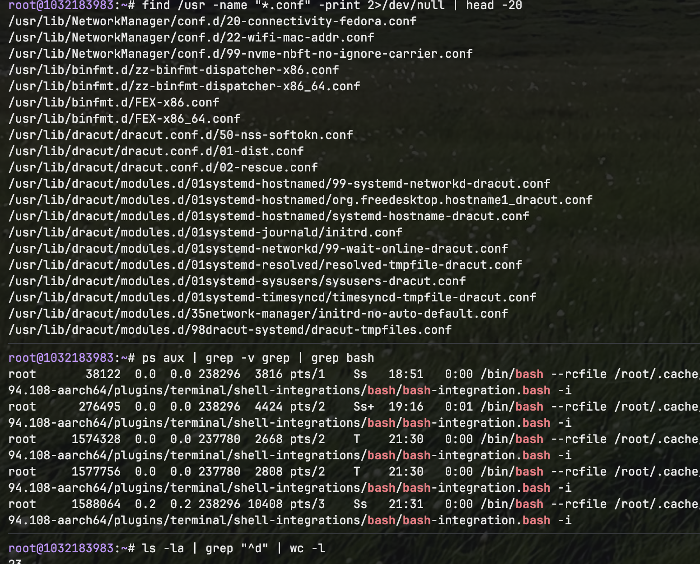{#fig:012 width=70%}

# Выводы

В ходе выполнения лабораторной работы были освоены основные инструменты для поиска файлов и фильтрации текстовых данных в операционной системе Linux. Изучены принципы перенаправления ввода-вывода и использования конвейеров для объединения команд. Получены практические навыки управления процессами и заданиями, включая запуск программ в фоновом режиме, определение идентификаторов процессов и их завершение. Освоены команды для проверки использования дискового пространства и обслуживания файловых систем.

# Контрольные вопросы

1. **Какие потоки ввода-вывода вы знаете?**

   В Linux существуют три стандартных потока:
   - **stdin** (стандартный ввод) — файловый дескриптор 0, по умолчанию клавиатура
   - **stdout** (стандартный вывод) — файловый дескриптор 1, по умолчанию консоль
   - **stderr** (стандартный вывод ошибок) — файловый дескриптор 2, по умолчанию консоль

2. **Объясните разницу между операцией > и >>.**

   - `>` — перенаправляет вывод в файл с полной перезаписью содержимого
   - `>>` — перенаправляет вывод в файл с добавлением в конец (режим дозаписи)

3. **Что такое конвейер?**

   Конвейер (pipe) — механизм передачи вывода одной команды на ввод другой команды с помощью символа `|`. Позволяет объединять простые команды в цепочки для сложной обработки данных.

4. **Что такое процесс? Чем это понятие отличается от программы?**

   Процесс — это выполняющаяся программа в памяти системы. Программа — это статический файл с исполняемым кодом, а процесс — это динамический экземпляр программы с собственным адресным пространством и системными ресурсами.

5. **Что такое PID и GID?**

   - **PID** (Process ID) — уникальный идентификатор процесса в системе
   - **GID** (Group ID) — идентификатор группы, к которой принадлежит процесс или пользователь

6. **Что такое задачи и какая команда позволяет ими управлять?**

   Задачи (jobs) — это процессы, запущенные в текущем сеансе терминала. Управление осуществляется командами:
   - `jobs` — просмотр активных заданий
   - `kill %номер` — завершение задания
   - `bg` — перевод в фоновый режим
   - `fg` — перевод в активный режим

7. **Найдите информацию об утилитах top и htop. Каковы их функции?**

   - **top** — стандартная утилита для мониторинга системных процессов в реальном времени, показывает загрузку CPU, память, список процессов
   - **htop** — улучшенная версия top с цветным интерфейсом, древовидным отображением процессов и интерактивным управлением

8. **Назовите и дайте характеристику команде поиска файлов. Приведите примеры использования этой команды.**

   Команда **find** — основной инструмент поиска файлов в Linux:
   ```bash
   find /path -name "pattern" -type f -exec command {} \;
   ```
   Примеры:
   - `find ~ -name "*.txt"` — поиск текстовых файлов
   - `find /etc -type d` — поиск директорий
   - `find . -size +100M` — поиск больших файлов

9. **Можно ли по контексту (содержанию) найти файл? Если да, то как?**

   Да, с помощью команды **grep**:
   ```bash
   grep -r "pattern" /path/
   find /path -type f -exec grep -l "pattern" {} \;
   ```

10. **Как определить объем свободной памяти на жёстком диске?**

    Командой **df** (disk free):
    ```bash
    df -h  # в человекочитаемом формате
    df -i  # информация об inodes
    ```

11. **Как определить объем вашего домашнего каталога?**

    Командой **du** (disk usage):
    ```bash
    du -sh ~     # общий размер
    du -h ~      # размер всех подкаталогов
    ```

12. **Как удалить зависший процесс?**

    Несколько способов:
    ```bash
    kill PID           # обычное завершение
    kill -9 PID        # принудительное завершение
    killall program    # завершение по имени
    pkill program      # завершение по шаблону имени
    ```