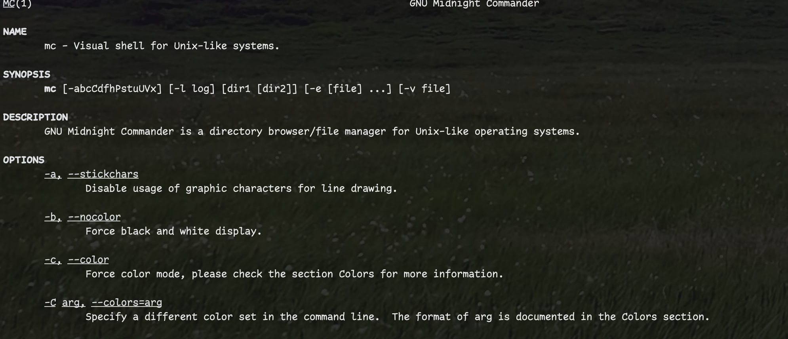
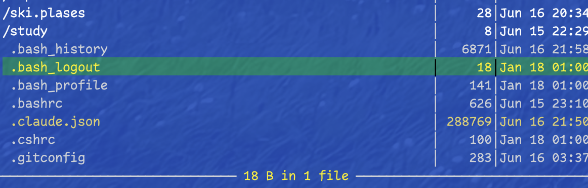
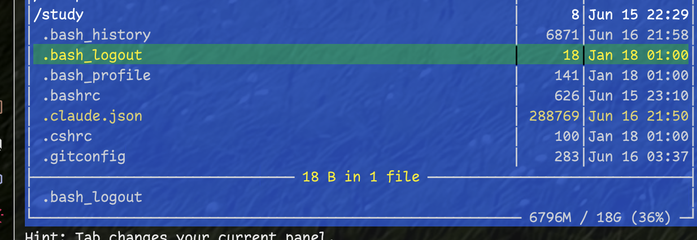
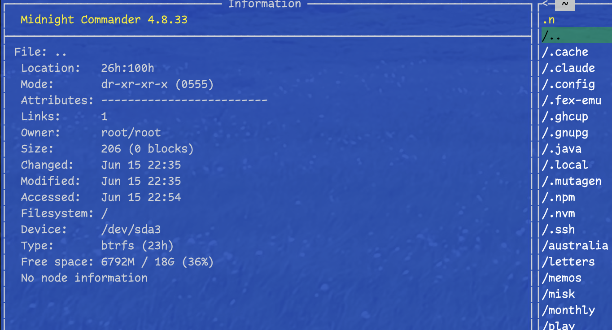
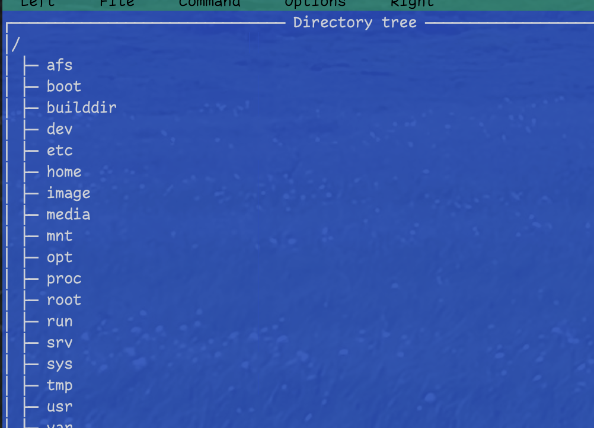
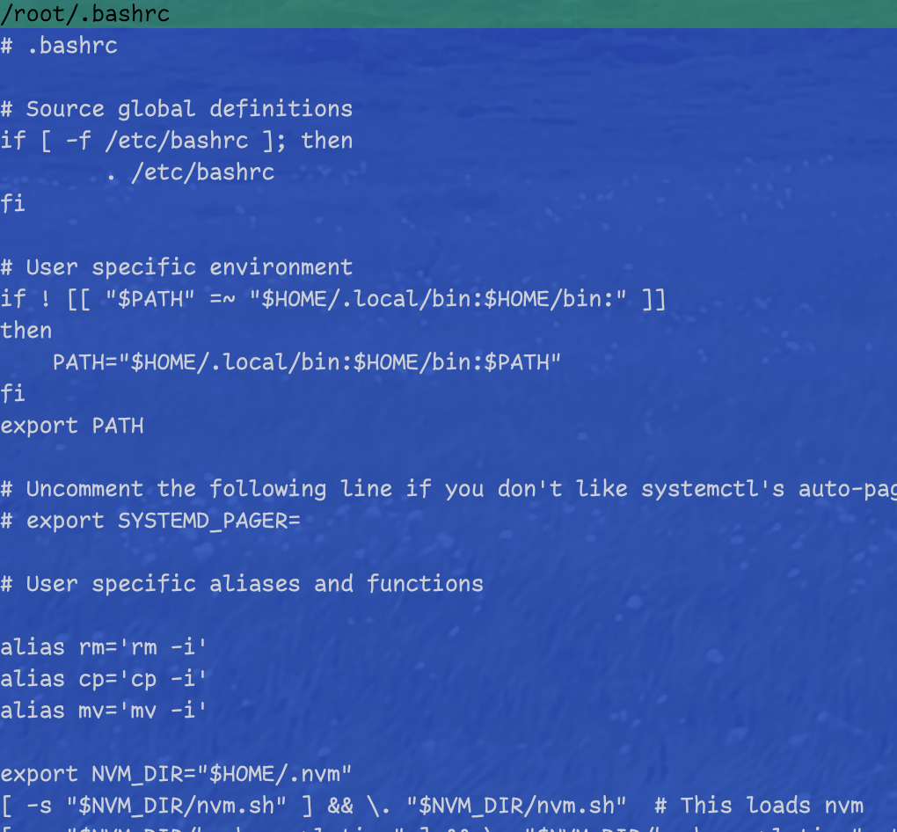
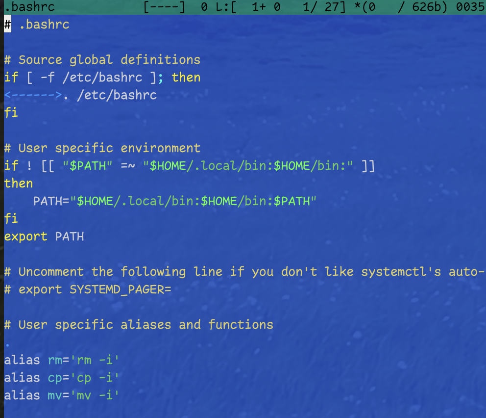
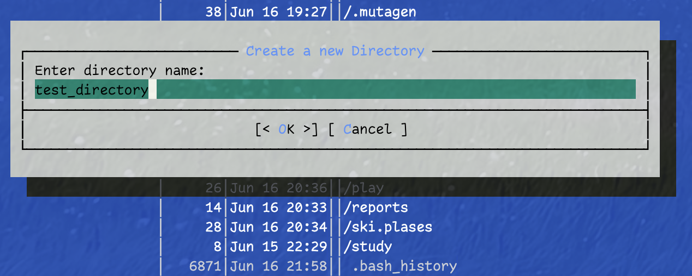

---
## Front matter
lang: ru-RU
title: Лабораторная работа №7
subtitle: Командная оболочка Midnight Commander
author:
  - Фёдор Симонов
institute:
  - Российский университет дружбы народов, Москва, Россия
date: 16 июня 2025

## i18n babel
babel-lang: russian
babel-otherlangs: english

## Formatting pdf
toc: false
toc-title: Содержание
slide_level: 2
aspectratio: 169
section-titles: true
theme: Madrid
header-includes:
  - \usepackage{polyglossia}
  - \setmainlanguage{russian}
  - \setotherlanguage{english}
  - \setmainfont{IBM Plex Serif}
  - \newfontfamily\cyrillicfontsf{IBM Plex Sans}
  - \newfontfamily\cyrillicfonttt{IBM Plex Mono}
---

# Цели и задачи работы

## Цель лабораторной работы

Освоение основных возможностей командной оболочки Midnight Commander. Приобретение навыков практической работы по просмотру каталогов и файлов; манипуляций с ними.

## Задачи

- Изучить структуру интерфейса MC
- Освоить функциональные клавиши F1-F10
- Изучить работу с панелями и меню
- Освоить операции с файлами и каталогами
- Изучить встроенный редактор MC

# Теоретическое введение

## Midnight Commander

:::::::::::::: {.columns align=center}
::: {.column width="50%"}

### Общие сведения
- Псевдографическая командная оболочка
- Двухпанельный интерфейс
- Система меню F9
- Командная строка

:::
::: {.column width="50%"}

### Запуск
```bash
mc
```

### Основные элементы
- Левая и правая панели
- Строка меню
- Функциональные клавиши

:::
::::::::::::::

## Функциональные клавиши

:::::::::::::: {.columns align=center}
::: {.column width="50%"}

### F1-F5
- **F1** — справка
- **F2** — пользовательское меню
- **F3** — просмотр файла
- **F4** — редактирование
- **F5** — копирование

:::
::: {.column width="50%"}

### F6-F10
- **F6** — перемещение
- **F7** — создание каталога
- **F8** — удаление
- **F9** — меню MC
- **F10** — выход

:::
::::::::::::::

## Система меню MC

Основные меню (F9):
- **Левая панель** — управление левой панелью
- **Файл** — операции с файлами
- **Команда** — общие команды MC
- **Настройки** — конфигурация
- **Правая панель** — управление правой панелью

# Выполнение лабораторной работы

## Задание 1-2. Изучение MC

Изучение справки и запуск MC:

```bash
# Изучение справочной информации
man mc

# Запуск Midnight Commander
mc
```

{#fig:001 width=70%}

## Задание 3. Операции с панелями

Основные операции с файлами:

```bash
# Выделение файлов: Insert
# Копирование: F5
# Перемещение: F6
# Информация: расширенный режим панели
```

{#fig:002 width=70%}

## Задание 4. Меню панелей

:::::::::::::: {.columns align=center}
::: {.column width="50%"}

### Форматы отображения
- Стандартный
- Ускоренный
- Расширенный
- Пользовательский

:::
::: {.column width="50%"}

### Режимы панелей
- Список файлов
- Информация
- Дерево каталогов
- Быстрый просмотр

:::
::::::::::::::

{#fig:003 width=60%}

## Задание 5. Меню "Файл"

Основные операции с файлами:

```bash
# Просмотр содержимого (F3)
# Редактирование (F4)
# Создание каталога (F7)
# Копирование файлов (F5)
```

{#fig:004 width=70%}

## Задание 6. Меню "Команда"

:::::::::::::: {.columns align=center}
::: {.column width="50%"}

### Поиск файлов
```bash
# Критерии поиска:
# Маска: *.c, *.cpp
# Содержание: main
```

:::
::: {.column width="50%"}

### Навигация
```bash
# История команд
# Быстрые каталоги
# Переход в домашний каталог
```

:::
::::::::::::::

{#fig:005 width=70%}

## Задание 7. Настройки MC

Конфигурация интерфейса:

- **Full screen** — полноэкранный режим
- **Double Width** — двойная ширина
- **Show Hidden Files** — скрытые файлы
- **Подтверждения** операций

{#fig:006 width=70%}

## Задание 8. Встроенный редактор

### Создание и редактирование файла

```bash
# Создание файла text.txt
# Вставка текста из внешнего источника
```

{#fig:007 width=60%}

## Операции редактирования

:::::::::::::: {.columns align=center}
::: {.column width="50%"}

### Команды редактора
- **Ctrl-y** — удаление строки
- **F3** — выделение блока
- **F5** — копирование блока
- **F6** — перемещение блока

:::
::: {.column width="50%"}

### Навигация
- **Ctrl-Home** — в начало
- **Ctrl-End** — в конец
- **F2** — сохранение
- **Ctrl-u** — отмена операции

:::
::::::::::::::

{#fig:008 width=70%}

## Программный код

Работа с исходным кодом:

- Открытие файлов программ
- Подсветка синтаксиса
- Редактирование кода
- Сохранение изменений

{#fig:009 width=70%}

# Результаты

## Освоенные возможности MC

- Двухпанельный файловый интерфейс
- Система функциональных клавиш F1-F10
- Меню управления панелями и файлами
- Различные режимы отображения панелей
- Операции с файлами и каталогами

## Навыки работы с редактором

- Создание и редактирование текстовых файлов
- Операции с блоками текста
- Навигация по файлу
- Работа с программным кодом
- Настройка подсветки синтаксиса

# Выводы

## Выводы

В ходе выполнения лабораторной работы:

- Освоены основные возможности Midnight Commander
- Изучена структура интерфейса и система меню
- Получены навыки работы с файлами и каталогами
- Освоен встроенный редактор MC
- Изучены настройки и конфигурация программы

## Спасибо за внимание!