---
## Front matter
title: "Отчёт по лабораторной работе №7"
subtitle: "Командная оболочка Midnight Commander"
author: "Фёдор Симонов"

## Generic otions
lang: ru-RU
toc-title: "Содержание"

## Bibliography
bibliography: bib/cite.bib
csl: pandoc/csl/gost-r-7-0-5-2008-numeric.csl

## Pdf output format
toc: true # Table of contents
toc-depth: 2
lof: true # List of figures
lot: true # List of tables
fontsize: 12pt
linestretch: 1.5
papersize: a4
documentclass: scrreprt
## I18n polyglossia
polyglossia-otherlangs:
  name: english
## I18n babel
babel-lang: russian
babel-otherlangs: english
## Fonts
mainfont: "IBM Plex Serif"
romanfont: "IBM Plex Serif"
sansfont: "IBM Plex Sans"
monofont: "IBM Plex Mono"
mathfont: "STIX Two Math"
mainfontoptions: Ligatures=Common,Ligatures=TeX,Scale=0.94
romanfontoptions: Ligatures=Common,Ligatures=TeX,Scale=0.94
sansfontoptions: Ligatures=Common,Ligatures=TeX,Scale=MatchLowercase,Scale=0.94
monofontoptions: Scale=MatchLowercase,Scale=0.94,FakeStretch=0.9
mathfontoptions:
## Biblatex
biblatex: true
biblio-style: "gost-numeric"
biblatexoptions:
  - parentracker=true
  - backend=biber
  - hyperref=auto
  - language=auto
  - autolang=other*
  - citestyle=gost-numeric
## pandoc-xnos customization
fignos-cleveref: True
fignos-plus-name: Рис.
tablenos-cleveref: True
tablenos-plus-name: Таблица
eqnos-cleveref: True
eqnos-plus-name: Ур.
secnos-cleveref: True
secnos-plus-name: Разд.
## Misc options
indent: true
header-includes:
  - \usepackage{hyperref}
  - \usepackage{indentfirst}
  - \usepackage{float} # keep figures where there are in the text
  - \floatplacement{figure}{H} # keep figures where there are in the text
---

# Цель работы

Освоение основных возможностей командной оболочки Midnight Commander. Приобретение навыков практической работы по просмотру каталогов и файлов; манипуляций с ними.

# Теоретические сведения

## Общие сведения о Midnight Commander

Командная оболочка — интерфейс взаимодействия пользователя с операционной системой и программным обеспечением посредством команд.

Midnight Commander (или mc) — псевдографическая командная оболочка для UNIX/Linux систем. Для запуска mc необходимо в командной строке набрать `mc` и нажать Enter.

## Структура интерфейса MC

Рабочее пространство mc имеет две панели, отображающие по умолчанию списки файлов двух каталогов. Над панелями располагается меню, доступ к которому осуществляется с помощью клавиши F9. Под панелями внизу расположены управляющие экранные кнопки, ассоциированные с функциональными клавишами F1–F10. Над ними располагается командная строка, предназначенная для ввода команд.

## Функциональные клавиши MC

| Клавиша | Функция |
|---------|----------|
| F1 | Вызов контекстно-зависимой подсказки |
| F2 | Вызов пользовательского меню |
| F3 | Просмотр содержимого файла |
| F4 | Вызов встроенного редактора |
| F5 | Копирование файлов |
| F6 | Перенос файлов |
| F7 | Создание подкаталога |
| F8 | Удаление файлов |
| F9 | Вызов меню mc |
| F10 | Выход из mc |

## Режимы отображения панелей

Панель в mc отображает список файлов текущего каталога. У активной панели заголовок и одна из её строк подсвечиваются. Панели можно поменять местами с помощью комбинации клавиш Ctrl-u или команды меню "Переставить панели".

Панели могут быть переведены в режимы:
- **Информация** — выводятся сведения о файле и файловой системе
- **Дерево** — выводится структура дерева каталогов

## Меню MC

В строке меню имеются пять меню:
- **Левая панель** — управление левой панелью
- **Файл** — операции с файлами
- **Команда** — общие команды MC
- **Настройки** — конфигурация MC
- **Правая панель** — управление правой панелью

## Встроенный редактор MC

Встроенный редактор вызывается функциональной клавишей F4. Основные команды редактирования:

| Команда | Функция |
|---------|----------|
| Ctrl-y | Удалить строку |
| Ctrl-u | Отмена последней операции |
| Ins | Вставка/замена |
| F7 | Поиск |
| F4 | Замена |
| F3 | Выделение |
| F5 | Копировать выделенное |
| F6 | Переместить выделенное |
| F8 | Удалить выделенное |
| F2 | Сохранить файл |
| F10 | Выйти из редактора |

# Выполнение лабораторной работы

## Задание 1. Изучение справочной информации mc

Изучим информацию о mc, вызвав в командной строке справочное руководство:

```bash
man mc
```

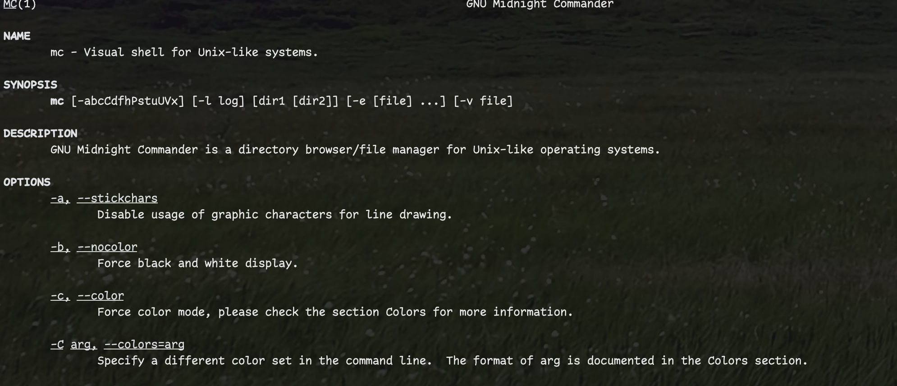{#fig:001 width=70%}

Справочное руководство содержит полную информацию о возможностях Midnight Commander, его опциях запуска и функциональности.

## Задание 2. Запуск и изучение структуры mc

Запустим из командной строки mc и изучим его структуру и меню:

```bash
mc
```

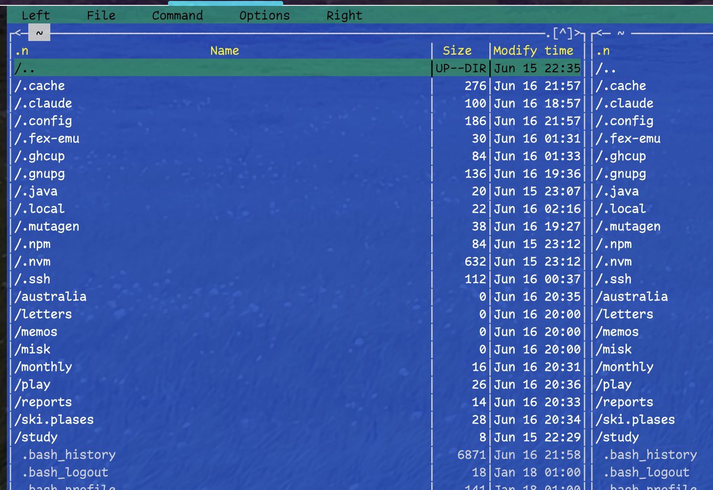{#fig:002 width=70%}

MC отображает две панели с файловыми списками, строку меню сверху, командную строку и функциональные клавиши снизу.

## Задание 3. Операции с панелями

Выполним несколько операций в mc, используя управляющие клавиши:

### Выделение и отмена выделения файлов

Используем клавишу Insert для выделения файлов и операции копирования/перемещения:

```bash
# Навигация по файлам: стрелки или Tab
# Выделение файла: Insert
# Копирование: F5
# Перемещение: F6
```

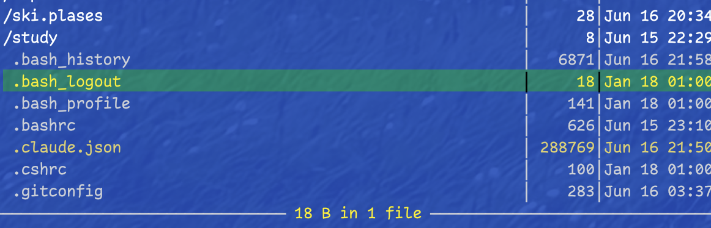{#fig:003 width=70%}

### Получение информации о файлах

Изучим информацию о размере и правах доступа на файлы. Переключимся в расширенный режим отображения панели:

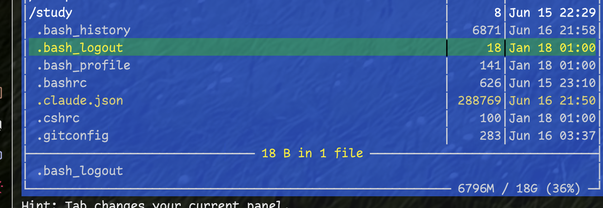{#fig:004 width=70%}

## Задание 4. Команды меню панелей

Выполним основные команды меню левой панели через F9 → Левая панель:

### Формат списка панели

Оценим степень подробности вывода информации о файлах в различных форматах:

- Стандартный формат
- Ускоренный формат  
- Расширенный формат

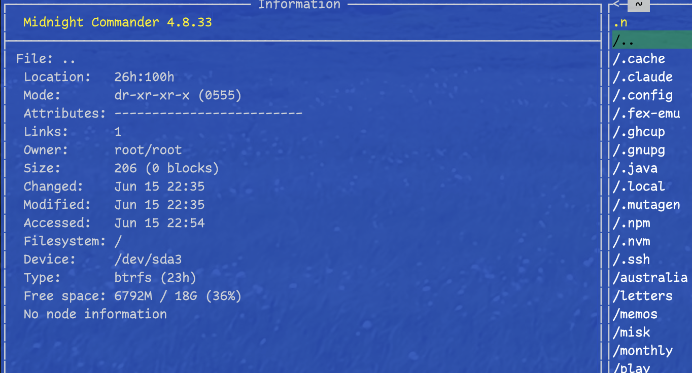{#fig:005 width=70%}

### Режимы панели

Переключимся между режимами "Информация" и "Дерево каталогов":

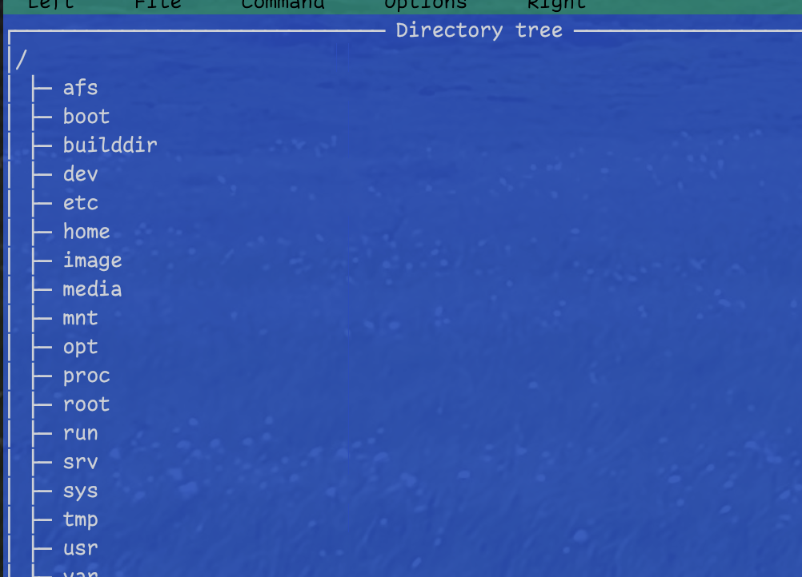{#fig:006 width=70%}

## Задание 5. Работа с подменю "Файл"

Используя возможности подменю Файл, выполним основные операции:

### Просмотр содержимого текстового файла (F3)

```bash
# Выбрать текстовый файл и нажать F3
```

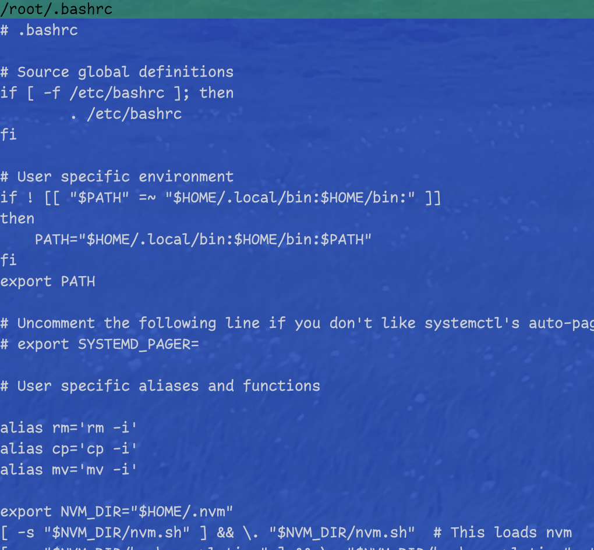{#fig:007 width=70%}

### Редактирование файла (F4)

Откроем файл для редактирования, но не будем сохранять изменения:

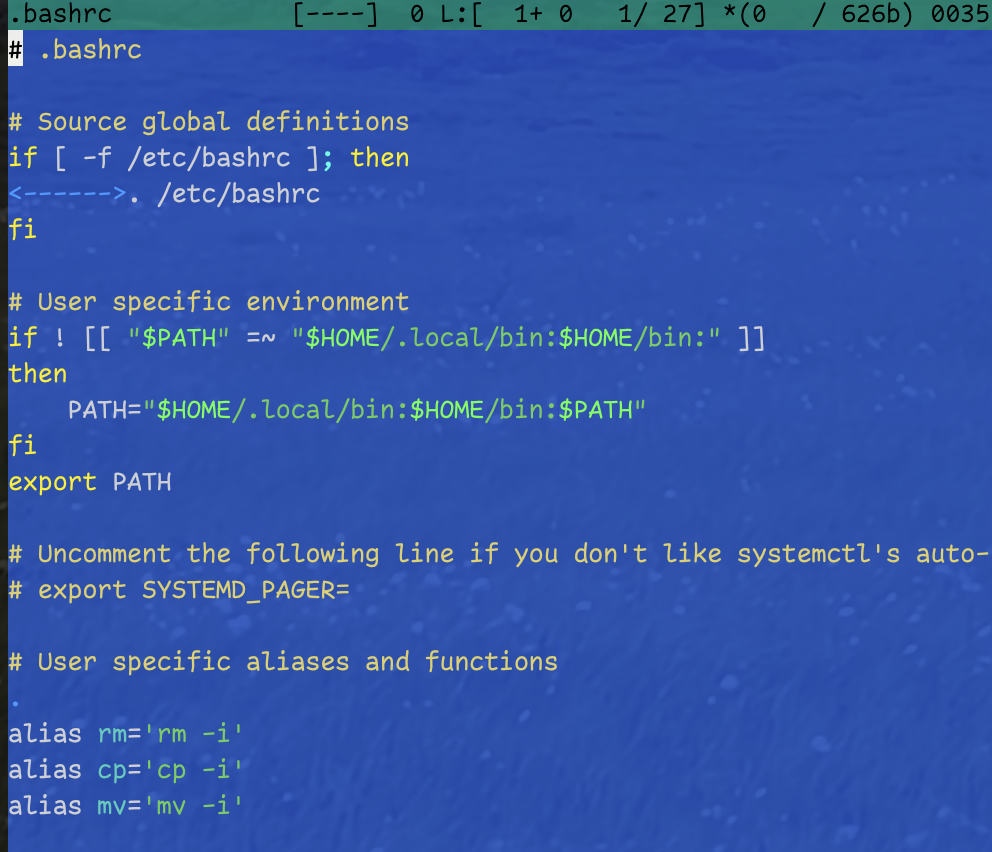{#fig:008 width=70%}

### Создание каталога (F7)

Создадим новый каталог:

```bash
# Нажать F7 и ввести имя каталога
mkdir test_directory
```

### Копирование файлов

Скопируем файлы в созданный каталог:

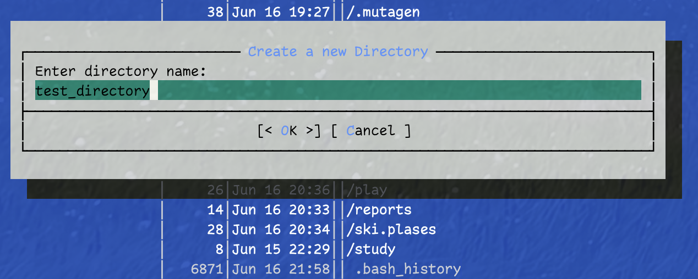{#fig:009 width=70%}

## Задание 6. Работа с подменю "Команда"

С помощью соответствующих средств подменю Команда осуществим:

### Поиск файлов

Найдем в файловой системе файлы с заданными условиями (файлы с расширением .c или .cpp, содержащие строку main):

```bash
# F9 → Команда → Поиск файла
# Задать критерии поиска: *.c, *.cpp
# Содержание: main
```

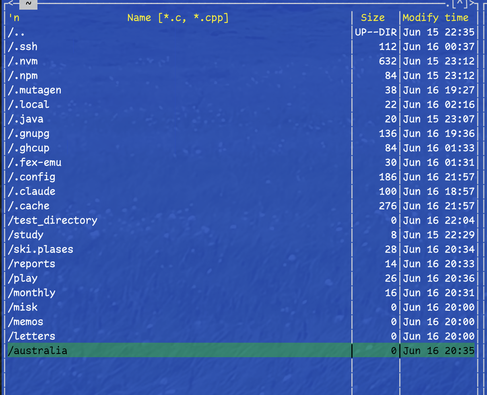{#fig:010 width=70%}

### История командной строки

Выберем и повторим одну из предыдущих команд:

```bash
# F9 → Команда → История командной строки
```

### Переход в домашний каталог

Используем быстрые каталоги для навигации:

```bash
# F9 → Команда → Каталоги быстрого доступа
# Или Ctrl-\
```

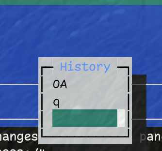{#fig:011 width=70%}

## Задание 7. Подменю "Настройки"

Вызовем подменю Настройки и освоим операции, определяющие структуру экрана mc:

### Настройки отображения

Изучим опции:
- Full screen (полноэкранный режим)
- Double Width (двойная ширина)
- Show Hidden Files (показать скрытые файлы)

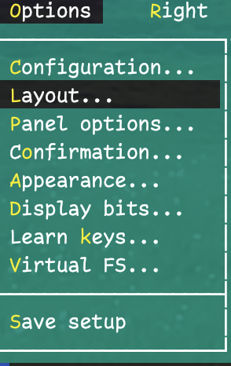{#fig:012 width=70%}

## Задание 8. Работа со встроенным редактором mc

### Создание файла text.txt

Создадим текстовой файл text.txt:

```bash
# F4 на несуществующем файле или F7 → ввод имени файла
```

### Вставка текста

Откроем файл с помощью встроенного редактора и вставим фрагмент текста:

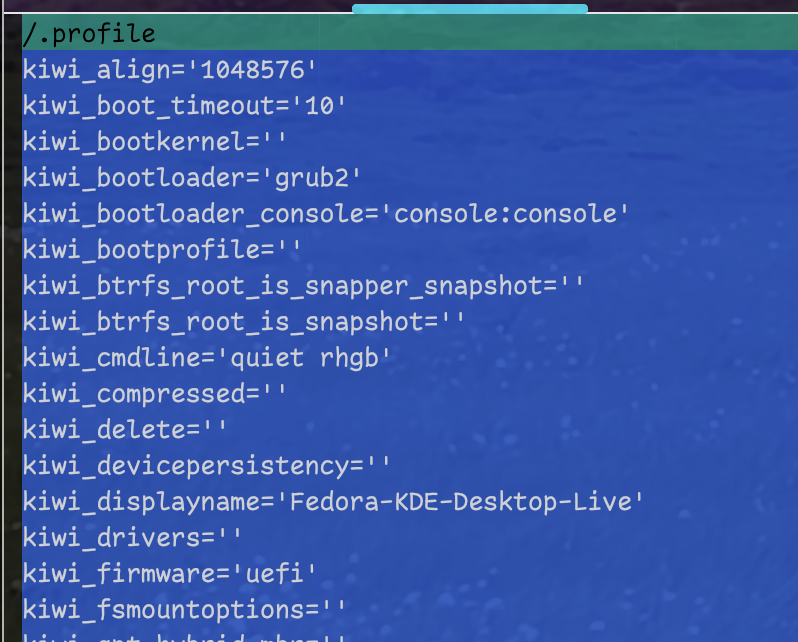{#fig:013 width=70%}

### Манипуляции с текстом

Проделаем следующие операции с текстом:

#### Удаление строки (Ctrl-y)
#### Выделение и копирование фрагмента (F3, F5)
#### Выделение и перемещение фрагмента (F3, F6)
#### Сохранение файла (F2)
#### Отмена последнего действия (Ctrl-u)

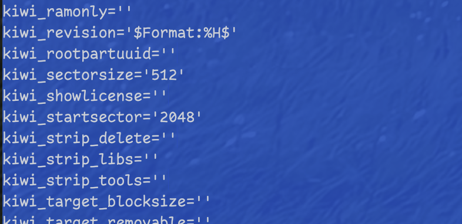{#fig:014 width=70%}

#### Навигация в файле

Перейдем в конец файла (Ctrl-End) и напишем текст, затем в начало файла (Ctrl-Home):

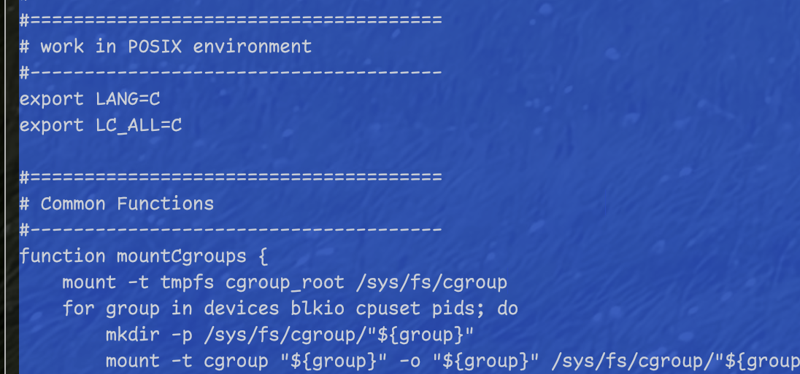{#fig:015 width=70%}

### Работа с программным кодом

Откроем файл с исходным текстом на языке программирования и включим/выключим подсветку синтаксиса:

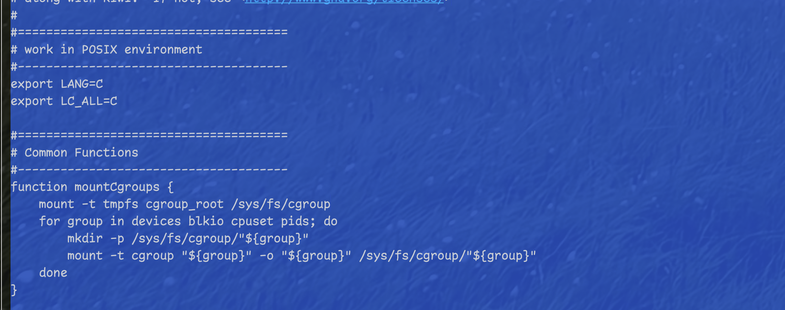{#fig:016 width=70%}

# Выводы

В ходе выполнения лабораторной работы были освоены основные возможности командной оболочки Midnight Commander. Изучена структура интерфейса MC, включающая двухпанельное отображение файлов, систему меню и функциональные клавиши. Получены практические навыки работы с файлами и каталогами: просмотр, редактирование, копирование, перемещение и удаление. Освоены различные режимы отображения панелей и настройки программы. Изучены возможности встроенного редактора MC для работы с текстовыми файлами и программным кодом. Полученные навыки позволяют эффективно использовать MC для управления файловой системой в среде Linux.

# Контрольные вопросы

1. **Какие режимы работы есть в mc. Охарактеризуйте их.**

   В MC существуют следующие режимы работы панелей:
   - **Стандартный** — отображает список файлов с основной информацией (имя, размер, время модификации)
   - **Ускоренный** — показывает только имена файлов в несколько колонок для быстрого просмотра
   - **Расширенный** — выводит подробную информацию о правах доступа, владельце, группе, размере
   - **Определённый пользователем** — позволяет настроить отображаемые поля по желанию пользователя
   - **Информация** — показывает детальные сведения о выбранном файле и файловой системе
   - **Дерево каталогов** — отображает иерархическую структуру каталогов

2. **Какие операции с файлами можно выполнить как с помощью команд shell, так и с помощью меню (комбинаций клавиш) mc?**

   Операции, доступные в обоих интерфейсах:
   - Копирование файлов: `cp` / F5
   - Перемещение файлов: `mv` / F6
   - Удаление файлов: `rm` / F8
   - Создание каталогов: `mkdir` / F7
   - Просмотр файлов: `cat`, `less` / F3
   - Редактирование файлов: редакторы (`nano`, `vim`) / F4
   - Поиск файлов: `find` / Команда → Поиск файла
   - Изменение прав доступа: `chmod` / Ctrl-x c
   - Изменение владельца: `chown` / Ctrl-x o

3. **Опишите структуру меню левой (или правой) панели mc, дайте характеристику командам.**

   Меню панели (F9 → Левая/Правая панель) содержит:
   - **Формат списка** — выбор режима отображения файлов
   - **Порядок сортировки** — сортировка по имени, размеру, времени, расширению
   - **Фильтр** — отбор файлов по маске
   - **Кодировка** — выбор кодировки для отображения имён файлов
   - **Дерево каталогов** — переключение в режим древовидного отображения
   - **Быстрый просмотр** — предварительный просмотр выбранного файла
   - **Информация** — детальная информация о файле и диске

4. **Опишите структуру меню Файл mc, дайте характеристику командам.**

   Меню Файл содержит команды для работы с файлами:
   - **Просмотр (F3)** — просмотр содержимого без редактирования
   - **Правка (F4)** — редактирование файла во встроенном редакторе
   - **Копирование (F5)** — копирование файлов/каталогов
   - **Переименование (F6)** — переименование или перемещение
   - **Создание каталога (F7)** — создание нового каталога
   - **Удалить (F8)** — удаление файлов/каталогов
   - **Права доступа** — изменение прав доступа (chmod)
   - **Владелец/группа** — изменение владельца и группы (chown)
   - **Жёсткая ссылка** — создание жёсткой ссылки
   - **Символическая ссылка** — создание символической ссылки

5. **Опишите структуру меню Команда mc, дайте характеристику командам.**

   Меню Команда содержит общие команды MC:
   - **Дерево каталогов** — отображение структуры каталогов системы
   - **Поиск файла** — поиск файлов по различным критериям
   - **Переставить панели** — смена местами левой и правой панелей
   - **Сравнить каталоги** — сравнение содержимого панелей
   - **История командной строки** — список ранее выполненных команд
   - **Каталоги быстрого доступа** — быстрая навигация по избранным каталогам
   - **Восстановление файлов** — восстановление удалённых файлов (ext2/ext3)
   - **Редактировать файл расширений** — настройка действий для типов файлов
   - **Редактировать файл меню** — настройка пользовательского меню

6. **Опишите структуру меню Настройки mc, дайте характеристику командам.**

   Меню Настройки содержит опции конфигурации:
   - **Конфигурация** — основные настройки работы MC
   - **Внешний вид** — настройка отображаемых элементов интерфейса
   - **Настройки панелей** — конфигурация панелей и их поведения
   - **Подтверждение** — настройка запросов подтверждения операций
   - **Биты символов** — настройка обработки символов и кодировок
   - **Распознание клавиш** — тестирование и настройка клавиатуры
   - **Виртуальные ФС** — настройки виртуальных файловых систем
   - **Сохранить настройки** — сохранение текущей конфигурации

7. **Назовите и дайте характеристику встроенным командам mc.**

   Основные встроенные команды MC:
   - **cd** — смена текущего каталога
   - Навигационные команды (стрелки, Page Up/Down, Home/End)
   - **Tab** — переключение между панелями
   - **Ctrl-o** — временное скрытие панелей для просмотра вывода команд
   - **Ctrl-u** — смена панелей местами
   - **Ctrl-r** — обновление содержимого панелей
   - **Ctrl-s** — быстрый поиск файлов в текущем каталоге
   - **Ctrl-\\** — каталоги быстрого доступа

8. **Назовите и дайте характеристику командам встроенного редактора mc.**

   Команды встроенного редактора MC:
   - **Ctrl-y** — удаление текущей строки
   - **Ctrl-u** — отмена последней операции
   - **Ctrl-k** — удаление от курсора до конца строки
   - **F7** — поиск текста (с поддержкой регулярных выражений)
   - **Shift-F7** — повтор последнего поиска
   - **F4** — замена текста
   - **F3** — начало/конец выделения блока
   - **F5** — копирование выделенного блока
   - **F6** — перемещение выделенного блока
   - **F8** — удаление выделенного блока
   - **F2** — сохранение файла
   - **F10** — выход из редактора

9. **Дайте характеристику средствам mc, которые позволяют создавать меню, определяемые пользователем.**

   MC предоставляет возможность создания пользовательских меню через:
   - **Файл пользовательского меню** — редактируется через Команда → Редактировать файл меню
   - **Синтаксис меню** — использует специальные макросы (%f - текущий файл, %d - текущий каталог, %t - выделенные файлы)
   - **Условные команды** — возможность создания команд, зависящих от типа файла
   - **Горячие клавиши** — назначение быстрых клавиш для пользовательских команд
   - **Вызов меню** — через F2 или Команда → Пользовательское меню

10. **Дайте характеристику средствам mc, которые позволяют выполнять действия, определяемые пользователем, над текущим файлом.**

    MC позволяет определять пользовательские действия через:
    - **Файл расширений** — связывает расширения файлов с командами (редактируется через Команда → Редактировать файл расширений)
    - **Макросы файлов** — %f (текущий файл), %b (текущий файл без расширения), %e (расширение)
    - **Автоматический запуск** — программы автоматически запускаются при нажатии Enter на файле
    - **Контекстные действия** — различные действия для просмотра, редактирования, выполнения файлов
    - **Условная обработка** — действия могут зависеть от типа файла, его размера, прав доступа
    - **Интеграция с внешними программами** — возможность использования любых системных команд и программ