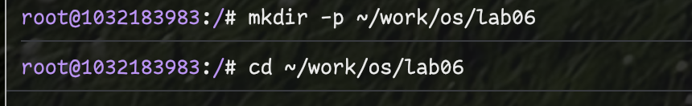
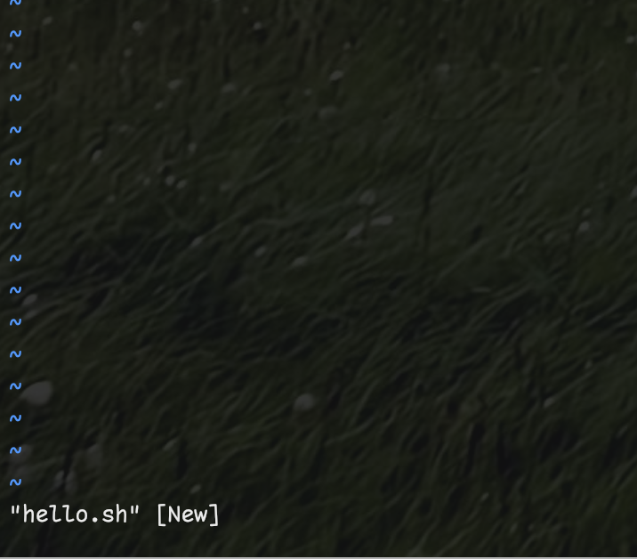
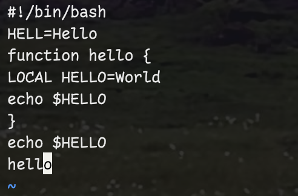
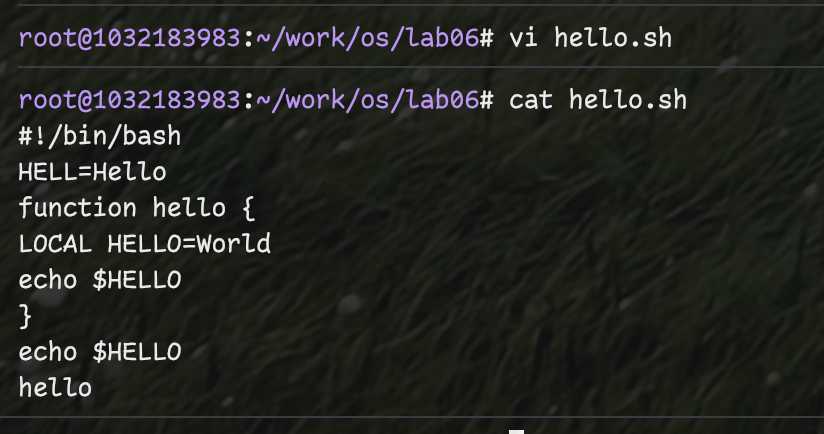
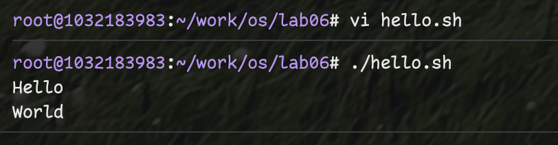
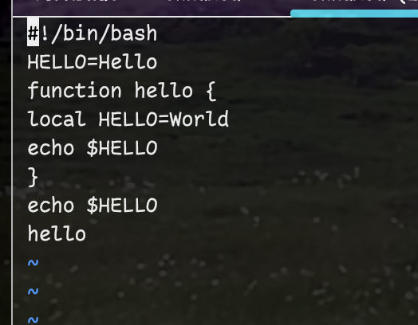

---
## Front matter
lang: ru-RU
title: Лабораторная работа №8
subtitle: Текстовой редактор vi
author:
  - Фёдор Симонов
institute:
  - Российский университет дружбы народов, Москва, Россия
date: 16 июня 2025

## i18n babel
babel-lang: russian
babel-otherlangs: english

## Formatting pdf
toc: false
toc-title: Содержание
slide_level: 2
aspectratio: 169
section-titles: true
theme: Madrid
header-includes:
  - \usepackage{polyglossia}
  - \setmainlanguage{russian}
  - \setotherlanguage{english}
  - \setmainfont{IBM Plex Serif}
  - \newfontfamily\cyrillicfontsf{IBM Plex Sans}
  - \newfontfamily\cyrillicfonttt{IBM Plex Mono}
---

# Цели и задачи работы

## Цель лабораторной работы

Познакомиться с операционной системой Linux. Получить практические навыки работы с редактором vi, установленным по умолчанию практически во всех дистрибутивах.

## Задачи

- Изучить три режима работы редактора vi
- Освоить основные команды навигации и редактирования
- Научиться создавать и редактировать файлы
- Освоить команды сохранения и выхода
- Изучить команды отмены изменений

# Теоретическое введение

## Редактор vi

:::::::::::::: {.columns align=center}
::: {.column width="50%"}

### Общие сведения
- Интерактивный экранный редактор
- Устанавливается по умолчанию в Linux
- Три режима работы
- Регистрозависимые команды

:::
::: {.column width="50%"}

### Запуск
```bash
vi <имя_файла>
```

### Три режима
- Командный режим
- Режим вставки  
- Режим последней строки

:::
::::::::::::::

## Режимы работы vi

:::::::::::::: {.columns align=center}
::: {.column width="50%"}

### Командный режим
- Навигация по файлу
- Команды редактирования
- Основной режим работы
- Активация: Esc

:::
::: {.column width="50%"}

### Режим вставки  
- Ввод текста
- Редактирование содержимого
- Активация: i, a, o
- Выход: Esc

:::
::::::::::::::

### Режим последней строки
- Сложные команды (:)
- Сохранение файла (:w)
- Выход из редактора (:q)

## Основные команды

:::::::::::::: {.columns align=center}
::: {.column width="50%"}

### Навигация
- **h, j, k, l** — курсор влево, вниз, вверх, вправо
- **0, $** — начало/конец строки
- **G, gg** — конец/начало файла
- **w, b** — по словам

:::
::: {.column width="50%"}

### Редактирование
- **i, a** — вставка текста
- **o, O** — новая строка
- **x, dd** — удаление
- **u** — отмена
- **yy, p** — копирование/вставка

:::
::::::::::::::

# Выполнение лабораторной работы

## Задание 1. Создание файла hello.sh

### Подготовка рабочей среды

```bash
mkdir -p ~/work/os/lab06
cd ~/work/os/lab06
vi hello.sh
```

{#fig:001 width=70%}

## Ввод содержимого файла

### Переход в режим вставки

Нажимаем **i** и вводим:

```bash
#!/bin/bash
HELL=Hello
function hello {
LOCAL HELLO=World
echo $HELLO
}
echo $HELLO
hello
```

{#fig:002 width=70%}

## Сохранение и выход

### Команды сохранения

```bash
# Esc - переход в командный режим
# : - переход в режим последней строки
# wq - сохранить и выйти
```

{#fig:003 width=70%}

## Проверка выполнения

### Установка прав и запуск

```bash
chmod +x hello.sh
./hello.sh
```

{#fig:004 width=70%}

## Задание 2. Редактирование файла

### Открытие файла для редактирования

```bash
vi ~/work/os/lab06/hello.sh
```

{#fig:005 width=70%}

## Исправление ошибок

:::::::::::::: {.columns align=center}
::: {.column width="50%"}

### Замена HELL на HELLO
- Позиционирование курсора
- Переход в режим вставки
- Редактирование текста

:::
::: {.column width="50%"}

### Замена LOCAL на local
- Навигация по файлу
- Удаление слова
- Ввод нового текста

:::
::::::::::::::

{#fig:006 width=70%}

## Операции с строками

### Добавление и удаление строк

```bash
# o - новая строка под курсором
# dd - удаление строки
# u - отмена последнего действия
```

{#fig:007 width=70%}

## Сохранение изменений

### Финальное сохранение

```bash
# :wq - сохранить изменения и выйти
./hello.sh  # проверка работы
```

{#fig:008 width=70%}

# Результаты

## Освоенные команды vi

- **Режимы работы**: командный, вставки, последней строки
- **Навигация**: h/j/k/l, 0/$, G/gg, w/b
- **Редактирование**: i/a/o, x/dd, u, yy/p
- **Файловые операции**: :w, :q, :wq, :q!

## Практические навыки

- Создание новых файлов с помощью vi
- Редактирование существующих файлов
- Использование команд отмены изменений
- Сохранение файлов и выход из редактора
- Работа с bash-скриптами

# Выводы

## Выводы

В ходе выполнения лабораторной работы:

- Изучены три режима работы редактора vi
- Освоены основные команды навигации и редактирования
- Получены практические навыки создания и редактирования файлов
- Изучены команды сохранения, выхода и отмены изменений
- Продемонстрирована эффективность vi для работы в командной строке

## Спасибо за внимание!