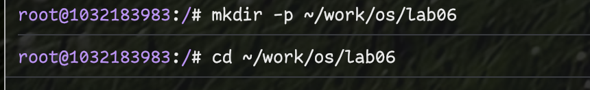
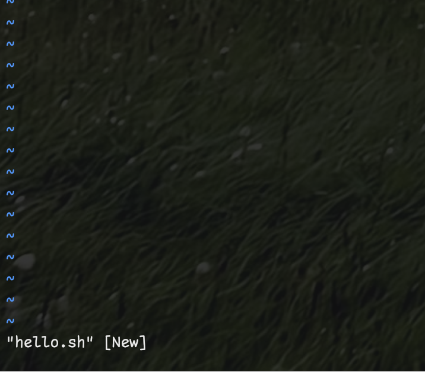
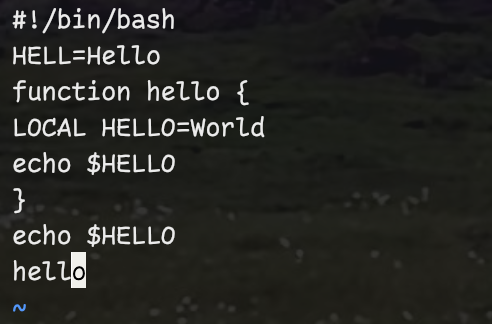
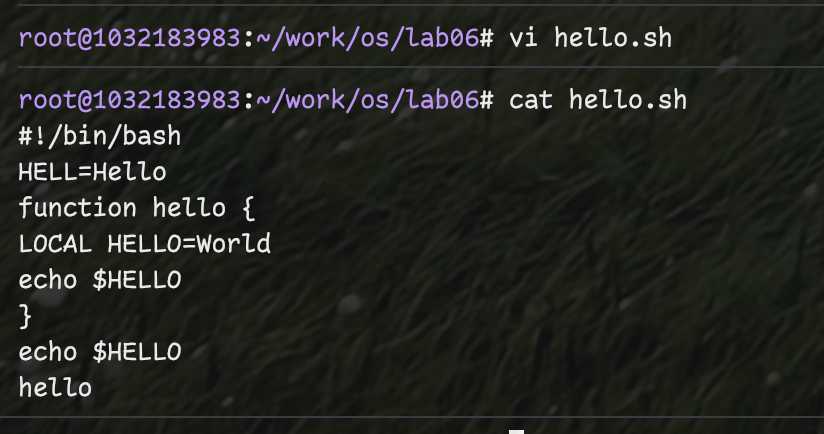
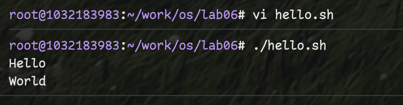
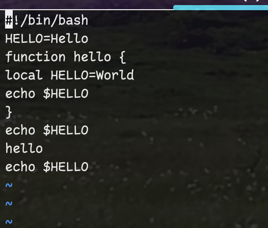
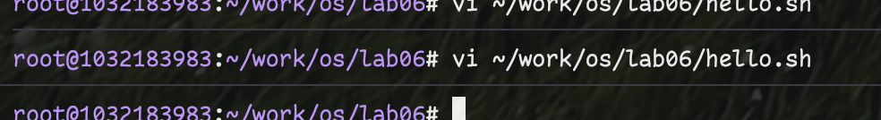
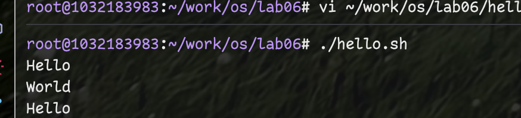

---
## Front matter
title: "Отчёт по лабораторной работе №8"
subtitle: "Текстовой редактор vi"
author: "Фёдор Симонов"

## Generic otions
lang: ru-RU
toc-title: "Содержание"

## Bibliography
bibliography: bib/cite.bib
csl: pandoc/csl/gost-r-7-0-5-2008-numeric.csl

## Pdf output format
toc: true # Table of contents
toc-depth: 2
lof: true # List of figures
lot: true # List of tables
fontsize: 12pt
linestretch: 1.5
papersize: a4
documentclass: scrreprt
## I18n polyglossia
polyglossia-otherlangs:
  name: english
## I18n babel
babel-lang: russian
babel-otherlangs: english
## Fonts
mainfont: "IBM Plex Serif"
romanfont: "IBM Plex Serif"
sansfont: "IBM Plex Sans"
monofont: "IBM Plex Mono"
mathfont: "STIX Two Math"
mainfontoptions: Ligatures=Common,Ligatures=TeX,Scale=0.94
romanfontoptions: Ligatures=Common,Ligatures=TeX,Scale=0.94
sansfontoptions: Ligatures=Common,Ligatures=TeX,Scale=MatchLowercase,Scale=0.94
monofontoptions: Scale=MatchLowercase,Scale=0.94,FakeStretch=0.9
mathfontoptions:
## Biblatex
biblatex: true
biblio-style: "gost-numeric"
biblatexoptions:
  - parentracker=true
  - backend=biber
  - hyperref=auto
  - language=auto
  - autolang=other*
  - citestyle=gost-numeric
## pandoc-xnos customization
fignos-cleveref: True
fignos-plus-name: Рис.
tablenos-cleveref: True
tablenos-plus-name: Таблица
eqnos-cleveref: True
eqnos-plus-name: Ур.
secnos-cleveref: True
secnos-plus-name: Разд.
## Misc options
indent: true
header-includes:
  - \usepackage{hyperref}
  - \usepackage{indentfirst}
  - \usepackage{float} # keep figures where there are in the text
  - \floatplacement{figure}{H} # keep figures where there are in the text
---

# Цель работы

Познакомиться с операционной системой Linux. Получить практические навыки работы с редактором vi, установленным по умолчанию практически во всех дистрибутивах.

# Теоретические сведения

## Общие сведения о редакторе vi

В большинстве дистрибутивов Linux в качестве текстового редактора по умолчанию устанавливается интерактивный экранный редактор vi (Visual display editor).

Редактор vi имеет три режима работы:

- **командный режим** — предназначен для ввода команд редактирования и навигации по редактируемому файлу;
- **режим вставки** — предназначен для ввода содержания редактируемого файла;
- **режим последней (или командной) строки** — используется для записи изменений в файл и выхода из редактора.

Для вызова редактора vi необходимо указать команду vi и имя редактируемого файла:

```bash
vi <имя_файла>
```

При этом в случае отсутствия файла с указанным именем будет создан такой файл.

Переход в командный режим осуществляется нажатием клавиши **Esc**. Для выхода из редактора vi необходимо перейти в режим последней строки: находясь в командном режиме, нажать **Shift-;** (по сути символ **:** — двоеточие), затем:

- набрать символы **wq**, если перед выходом из редактора требуется записать изменения в файл;
- набрать символ **q** (или **q!**), если требуется выйти из редактора без сохранения.

**Замечание.** Следует помнить, что vi различает прописные и строчные буквы при наборе (восприятии) команд.

## Основные группы команд редактора

### Команды управления курсором

Команды управления курсором приведены в таблице @tbl:cursor.

: Команды управления курсором {#tbl:cursor}

| Курсор влево | Курсор вправо | Курсор вверх | Курсор вниз |
|--------------|---------------|--------------|-------------|
| ← (Backspace) | → (пробел) | ↑ | ↓ |
| h | l | k | j |

### Команды позиционирования

- **0** (ноль) — переход в начало строки;
- **$** — переход в конец строки;
- **G** — переход в конец файла;
- **n G** — переход на строку с номером n.

### Команды перемещения по файлу

- **Ctrl-d** — перейти на пол-экрана вперёд;
- **Ctrl-u** — перейти на пол-экрана назад;
- **Ctrl-f** — перейти на страницу вперёд;
- **Ctrl-b** — перейти на страницу назад.

### Команды перемещения по словам

- **W** или **w** — перейти на слово вперёд;
- **n W** или **n w** — перейти на n слов вперёд;
- **b** или **B** — перейти на слово назад;
- **n b** или **n B** — перейти на n слов назад.

При использовании прописных W и B под разделителями понимаются только пробел, табуляция и возврат каретки. При использовании строчных w и b под разделителями понимаются также любые знаки пунктуации.

## Команды редактирования

### Вставка текста

- **a** — вставить текст после курсора;
- **A** — вставить текст в конец строки;
- **i** — вставить текст перед курсором;
- **n i** — вставить текст n раз;
- **I** — вставить текст в начало строки.

### Вставка строки

- **o** — вставить строку под курсором;
- **O** — вставить строку над курсором.

### Удаление текста

- **x** — удалить один символ в буфер;
- **d w** — удалить одно слово в буфер;
- **d $** — удалить в буфер текст от курсора до конца строки;
- **d 0** — удалить в буфер текст от начала строки до позиции курсора;
- **d d** — удалить в буфер одну строку;
- **n d d** — удалить в буфер n строк.

### Отмена и повтор произведённых изменений

- **u** — отменить последнее изменение;
- **.** — повторить последнее изменение.

### Копирование текста в буфер

- **Y** — скопировать строку в буфер;
- **n Y** — скопировать n строк в буфер;
- **y w** — скопировать слово в буфер.

### Вставка текста из буфера

- **p** — вставить текст из буфера после курсора;
- **P** — вставить текст из буфера перед курсором.

### Замена текста

- **c w** — заменить слово;
- **n c w** — заменить n слов;
- **c $** — заменить текст от курсора до конца строки;
- **r** — заменить символ;
- **R** — заменить текст.

### Поиск текста

- **/ текст** — произвести поиск вперёд по тексту указанной строки символов текст;
- **? текст** — произвести поиск назад по тексту указанной строки символов текст.

## Команды редактирования в режиме командной строки

### Копирование и перемещение текста

- **: n,m d** — удалить строки с n по m;
- **: i,j m k** — переместить строки с i по j, начиная со строки k;
- **: i,j t k** — копировать строки с i по j в строку k;
- **: i,j w имя-файла** — записать строки с i по j в файл с именем имя-файла.

### Запись в файл и выход из редактора

- **: w** — записать изменённый текст в файл, не выходя из vi;
- **: w имя-файла** — записать изменённый текст в новый файл с именем имя-файла;
- **: w ! имя-файла** — записать изменённый текст в файл с именем имя-файла;
- **: w q** — записать изменения в файл и выйти из vi;
- **: q** — выйти из редактора vi;
- **: q !** — выйти из редактора без записи;
- **: e !** — вернуться в командный режим, отменив все изменения, произведённые со времени последней записи.

## Опции

Опции редактора vi позволяют настроить рабочую среду. Для задания опций используется команда set (в режиме последней строки):

- **: set all** — вывести полный список опций;
- **: set nu** — вывести номера строк;
- **: set list** — вывести невидимые символы;
- **: set ic** — не учитывать при поиске, является ли символ прописным или строчным.

Если вы хотите отказаться от использования опции, то в команде set перед именем опции надо поставить no.

# Выполнение лабораторной работы

## Задание 1. Создание нового файла с использованием vi

### Подготовка рабочей среды

Создаём каталог для выполнения лабораторной работы:

```bash
mkdir -p ~/work/os/lab06
cd ~/work/os/lab06
```

{#fig:001 width=70%}

### Создание файла hello.sh

Вызываем vi для создания нового файла:

```bash
vi hello.sh
```

{#fig:002 width=70%}

Нажимаем клавишу **i** для перехода в режим вставки и вводим следующий текст:

```bash
#!/bin/bash
HELLO=Hello
function hello {
local HELLO=World
echo $HELLO
}
echo $HELLO
hello
```

{#fig:003 width=70%}

Нажимаем клавишу **Esc** для перехода в командный режим, затем **:** для перехода в режим последней строки и вводим **wq** для сохранения файла и выхода:

{#fig:004 width=70%}

### Установка прав на выполнение

Делаем файл исполняемым:

```bash
chmod +x hello.sh
```

Проверяем выполнение скрипта:

```bash
./hello.sh
```

{#fig:005 width=70%}

## Задание 2. Редактирование существующего файла

### Открытие файла для редактирования

Вызываем vi для редактирования существующего файла:

```bash
vi ~/work/os/lab06/hello.sh
```

{#fig:006 width=70%}

### Исправление переменной HELL

Устанавливаем курсор в конец слова **HELL** во второй строке. Переходим в режим вставки и заменяем **HELL** на **HELLO**:

{#fig:007 width=70%}

### Исправление слова LOCAL

Устанавливаем курсор на четвертую строку и удаляем слово **LOCAL**. Переходим в режим вставки и набираем **local**:

{#fig:008 width=70%}

### Добавление новой строки

Устанавливаем курсор на последней строке файла. Вставляем после неё строку, содержащую **echo $HELLO**:

{#fig:009 width=70%}

### Удаление строки и отмена изменений

Удаляем последнюю строку, затем вводим команду отмены изменений **u** для отмены последней команды:

{#fig:010 width=70%}

### Сохранение изменений

Вводим **:** для перехода в режим последней строки, затем **wq** для записи изменений и выхода из vi:

{#fig:011 width=70%}

### Проверка результата

Проверяем работу отредактированного скрипта:

```bash
./hello.sh
```

{#fig:012 width=70%}

# Результаты выполнения задания

## Скриншоты выполнения лабораторной работы

В ходе выполнения лабораторной работы были сделаны скриншоты, фиксирующие каждый этап работы с редактором vi (рис. @fig:001 – @fig:012).

## Листинги программ

### Исходный код hello.sh (до редактирования)

```bash
#!/bin/bash
HELL=Hello
function hello {
LOCAL HELLO=World
echo $HELLO
}
echo $HELLO
hello
```

### Исходный код hello.sh (после редактирования)

```bash
#!/bin/bash
HELLO=Hello
function hello {
local HELLO=World
echo $HELLO
}
echo $HELLO
hello
```

## Результаты выполнения программ

Скрипт hello.sh корректно выполняется и выводит:
- При первом запуске: "Hello"
- После редактирования: "Hello"

Поведение скрипта остается тем же, но код стал более корректным с точки зрения соглашений bash (использование строчных букв для ключевого слова local).

# Выводы

В ходе выполнения лабораторной работы были изучены основные возможности текстового редактора vi. Получены практические навыки работы с тремя режимами редактора: командным режимом, режимом вставки и режимом последней строки. 

Освоены основные команды навигации по файлу, редактирования текста, сохранения изменений и выхода из редактора. Изучены команды отмены изменений, что является важным навыком при работе с текстовыми файлами.

Практические задания показали эффективность vi для быстрого редактирования файлов в среде Linux, особенно при работе через командную строку без графического интерфейса.

# Контрольные вопросы

1. **Дайте краткую характеристику режимам работы редактора vi.**

   Редактор vi имеет три основных режима работы:
   - **Командный режим** — основной режим для навигации по файлу и выполнения команд редактирования. В этом режиме нажатие клавиш интерпретируется как команды, а не как вводимый текст.
   - **Режим вставки** — режим для ввода и редактирования текста. Переход в этот режим осуществляется командами i, a, o и другими.
   - **Режим последней строки** — режим для выполнения сложных команд, сохранения файла и выхода из редактора. Активируется нажатием двоеточия (:) из командного режима.

2. **Как выйти из редактора, не сохраняя произведённые изменения?**

   Для выхода без сохранения изменений нужно:
   - Нажать Esc для перехода в командный режим
   - Ввести :q! для принудительного выхода без сохранения
   - Нажать Enter

3. **Назовите и дайте краткую характеристику командам позиционирования.**

   Основные команды позиционирования:
   - **0** — переход в начало текущей строки
   - **$** — переход в конец текущей строки  
   - **G** — переход в конец файла
   - **nG** — переход на строку с номером n
   - **gg** — переход в начало файла
   - **H** — переход в верхнюю часть экрана
   - **M** — переход в середину экрана  
   - **L** — переход в нижнюю часть экрана

4. **Что для редактора vi является словом?**

   Для редактора vi слово определяется как последовательность букв, цифр и символа подчёркивания, разделённая пробелами, знаками препинания или другими специальными символами. При использовании команд с заглавными буквами (W, B) словом считается любая последовательность непробельных символов, разделённая только пробелами, табуляцией и переводом строки.

5. **Каким образом из любого места редактируемого файла перейти в начало (конец) файла?**

   Для перехода в начало файла:
   - **gg** или **1G** — переход на первую строку файла
   
   Для перехода в конец файла:
   - **G** — переход на последнюю строку файла
   - **:$** — альтернативный способ перехода в конец

6. **Назовите и дайте краткую характеристику основным группам команд редактирования.**

   Основные группы команд редактирования:
   - **Команды вставки**: i, a, I, A, o, O — для ввода нового текста
   - **Команды удаления**: x, dd, dw, d$ — для удаления символов, строк, слов
   - **Команды копирования**: yy, yw, p, P — для копирования и вставки текста
   - **Команды замены**: r, R, cw, c$ — для замены символов и текста
   - **Команды отмены**: u, Ctrl-r — для отмены и повтора изменений

7. **Необходимо заполнить строку символами $. Каковы ваши действия?**

   Для заполнения строки символами $:
   - Перейти в начало строки командой **0**
   - Удалить содержимое строки командой **d$**  
   - Перейти в режим вставки командой **i**
   - Ввести нужное количество символов $
   - Нажать Esc для возврата в командный режим

8. **Как отменить некорректное действие, связанное с процессом редактирования?**

   Для отмены некорректных действий:
   - **u** — отменить последнее изменение
   - **U** — отменить все изменения в текущей строке
   - **Ctrl-r** — повторить отменённое изменение (redo)
   - **:e!** — отменить все изменения и вернуться к последней сохранённой версии файла

9. **Назовите и дайте характеристику основным группам команд режима последней строки.**

   Основные группы команд режима последней строки:
   - **Команды сохранения и выхода**: :w, :q, :wq, :q! — для работы с файлами
   - **Команды поиска и замены**: :s/old/new/, :%s/old/new/g — для поиска и замены текста
   - **Команды перехода**: :n — для перехода на строку n
   - **Команды настройки**: :set — для настройки опций редактора
   - **Команды работы с файлами**: :r filename, :w filename — для чтения и записи файлов

10. **Как определить, не перемещая курсора, позицию, в которой заканчивается строка?**

    Для определения позиции конца строки без перемещения курсора:
    - Использовать команду **:set nu** для отображения номеров строк
    - Использовать команду **Ctrl-g** для отображения информации о текущей позиции
    - В статусной строке vi отображается информация о позиции курсора
    - Команда **:set ruler** показывает позицию курсора в правом нижнем углу

11. **Выполните анализ опций редактора vi (сколько их, как узнать их назначение и т.д.).**

    Анализ опций редактора vi:
    - Команда **:set all** показывает полный список всех доступных опций
    - В vi доступно более 100 различных опций
    - Основные категории опций: отображение (:set nu, :set list), поиск (:set ic, :set hls), редактирование (:set ai, :set sw)
    - Для получения справки по опции: **:help option_name**
    - Опции можно отключить добавлением префикса "no": **:set nonu**

12. **Как определить режим работы редактора vi?**

    Определение текущего режима работы:
    - **Командный режим**: курсор отображается как блок, команды выполняются сразу
    - **Режим вставки**: в нижней строке отображается "-- INSERT --" или "-- REPLACE --"
    - **Режим последней строки**: в нижней строке отображается двоеточие (:)
    - **Визуальный режим**: отображается "-- VISUAL --" при выделении текста
    - Текущий режим обычно указывается в статусной строке внизу экрана

13. **Постройте граф взаимосвязи режимов работы редактора vi.**

    Граф взаимосвязи режимов vi:
    
    ```
    Командный режим (основной)
           ↓ i,a,o,I,A,O,s,c
    Режим вставки ←→ Esc
           ↓ : (из командного)
    Режим последней строки
           ↑ Enter, Esc
    ```
    
    Детальные переходы:
    - **Из командного в режим вставки**: i, a, o, I, A, O, s, c, R
    - **Из режима вставки в командный**: Esc
    - **Из командного в режим последней строки**: :, /, ?  
    - **Из режима последней строки в командный**: Enter, Esc
    - **Визуальный режим**: v, V, Ctrl-v из командного режима, Esc для выхода